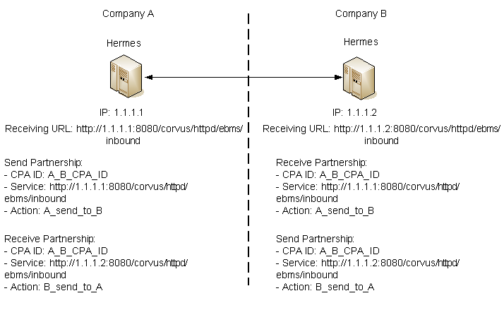
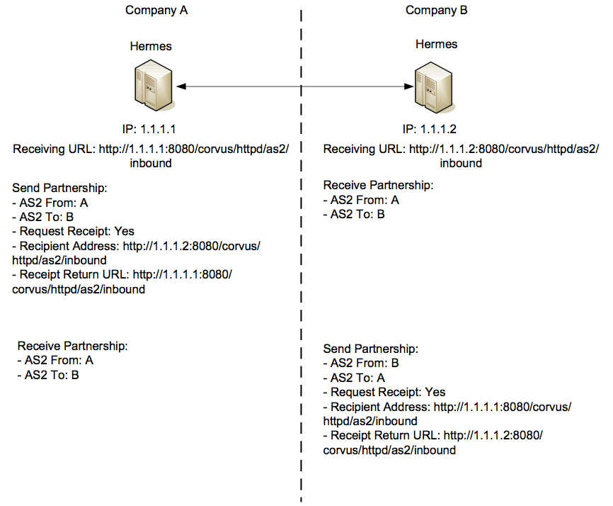

.. _appliaction:

Hermes 2 Application Development Guide
======================================

Introduction
------------

Purpose of This Document
^^^^^^^^^^^^^^^^^^^^^^^^

This document is to provide guidelines for developing messaging applications, whose messages are transferred by Hermes 2 reliably and securely. 
Hermes 2 provides web services for the application to communicate with Hermes 2. These web services allow the application to:

*  	Request Hermes 2 to send a payload to the Hermes 2 or a compatible messaging gateway on the receiver party;
*  	Retrieve the message identifiers of the received messages which have not received yet;
*  	Retrieve the payloads of a particular message which is identified by a message identifier; and
*  	Obtain the message status of outgoing and incoming messages.
    
Intended Audience
^^^^^^^^^^^^^^^^^

The intended audience of this document includes the application architect and developers who intend to design or implement a B-to-B application, whose business messages are transferred by Hermes 2 through ebMS 2.0 or AS2 protocol.

General Integration Architecture
^^^^^^^^^^^^^^^^^^^^^^^^^^^^^^^^

.. image:: _static/images/application/3_general_integration_architecture.png

Figure 1 - Typical Integration Architecture

The above figure shows a typical application integration architecture in which there are two parties exchange business messages with the assistance of Hermes 2 through ebMS 2.0 or AS2 over various transport protocols, such as HTTP, HTTPS or SMTP.

On the sending side, there is a backend system, which contains some business data to be transferred to the receiver party. The developers on the sender side need to develop an application, which extract the backend system and submits the data to Hermes 2 through web services. After submitting the payloads to Hermes 2, the application can also invoke a web service to check whether the delivery is successful.

On the receiver side, there is a backend system, which is responsible for storing the incoming business data, received from its business partner. The developers on the sender side need to develop an application, which invokes a web service provided by Hermes 2, to receive the business messages and payloads and persists them into the backend systems. In some cases, this receiving party may reply the sending party.

The application interfaces with Hermes 2 using web services. So, the benefits of web services generally apply. For example,

*  	Implementation independent. Since the application interfaces with Hermes 2 using web services, the application can be implemented in any programming languages, as long as the web service library is supported.
*  	Firewall friendly. The web services provided by Hermes 2 use HTTP as the transport protocol. The application needs to invoke the web services over HTTP but the Hermes 2 does not need to connect to the application. Therefore, even if there is a firewall between Hermes 2 and the application, the firewall is only required to allow HTTP connections from the application to Hermes 2. 

Partnerships
------------

Before deploying an application, we need to define a :literal:`partnership` in Hermes 2 that defines a channel to your business partner. A partnership is a **simplex** communication channel to your business partner. In a typical two-ways business document exchange, the Hermes 2 in each party should have two partnerships. One is for sending, another is for receiving. After the partnerships have been defined, the application can reference the partnerships to send or receive business messages.

The main benefit of partnerships is that it provides abstraction on technical parameters. The abstraction is beneficial because:

*	Since all the technical parameters, such as the communication protocols between the messaging gateways, endpoint URL, are contained in the partnership, the application does not need changes if your business partner changes the parameters.
*	The application only needs to submit the payloads. It does not contain any code that is specific to communication protocol between the messaging gateways. 
*	The application does not need to handle the raw and cryptic ebMS or AS2 messages. Therefore, the developers should only focus on business logic and integration with the backend systems.

Partnership for ebMS 2.0 
^^^^^^^^^^^^^^^^^^^^^^^^

If the communication protocol with your business partner’s messaging gateway is ebMS, CPA (Collaboration Protocol Agreement) ID, Service and Action are used to uniquely identify a partnership. Actually, these parameters are protocol parameters in ebMS protocol and their values appear in an ebMS message header. The meanings of these parameters for Send Partnership (the partnership for sending) and Receive Partnership (the partnership for receiving) are different:

*	The values of CPA ID, Service and Action in Send Partnership are taken as the values in the ebMS header of the outgoing messages sent by the Send Partnership. 
*	The values of CPA ID, Service and Action in Receive Partnership are taken as filtering criteria. If Hermes 2 receives an ebMS message whose CPA ID, Service and Action values do not have a matching partnership, a negative acknowledgement will be sent back to the sender and no application can retrieve the message on the receiver side.

For Hermes 2, the Service parameter for Send Partnership and Receive Partnership has to be HTTP URL (Universal Resource Locator) even though ebMS protocol allows a Service value that is not HTTP URL. The Service has different meanings in Send Partnership and Receive Partnership:

*	For Send Partnership, the Service acts as the endpoint URL of the sending Hermes to which the acknowledgement is sent by the receiver. That is, this should be the endpoint URL of the sending Hermes for receiving ebMS messages.
*	For Receive Partnership, since the Service is a filtering criterion for the incoming messages, it should be the endpoint URL of the sending Hermes.
	Let us look at a typical example below, in which two Hermes communicate in ebMS protocol and two partnerships are setup in each of them:

Figure 2 - Partnerships Example

In the above scenario, the Hermes in company A has an IP 1.1.1.1. So, its endpoint URL for receiving incoming ebMS messages is http://1.1.1.1:8080/corvus/httpd/ebms/inbound, where we suppose the application server is running on port 8080. Similarly, the endpoint URL for receiving ebMS messages of the Hermes in company B is http://1.1.1.2:8080/corvus/httpd/ebms/inbound.

Since a partnership is a simplex channel, each Hermes should have a pair of partnership, one for sending and another for receiving. The partnerships are identified by CPA ID, Service and Action. Their values should be negotiated between the two parties. 

The Service of the Send Partnership in the Hermes of company A should be the endpoint URL for receiving incoming ebMS messages or acknowledgements. Therefore, the Service should be http://1.1.1.1:8080/corvus/httpd/ebms/inbound. The messages sent by this Send Partnership will contain this Service value in the header, so the receiver Hermes will know where the acknowledgement should be sent to.

The Receive Partnership’s CPA ID, Service and Action form a filtering criterion for the incoming messages. Therefore, these values in the Receive Partnership in the receiving Hermes should be always the same as the Send Partnership in the sending Hermes.

In the above scenario, we assume that company B will reply a business message after it has receives a message. So, the Hermes in company B also has a Send Partnership and the Hermes in company A has a Receive Partnership. 

A partnership for ebMS has the following properties:

+----------------------------------------------------------------------------------------+----------------------------------------------------------------------------------------------------------------------------------------------------------------------------------------------------+------------------------------------------------------------------------------------------------------------------------+
| Properties                                                                             | Meaning for Send Partnership                                                                                                                                                                       | Meaning for Receiving Partnership                                                                                      |
+========================================================================================+====================================================================================================================================================================================================+========================================================================================================================+
| :code:`Transport Endpoint`                                                             | The endpoint URL of the receiving Hermes to which the message is sent                                                                                                                              | Ignored                                                                                                                |
+----------------------------------------------------------------------------------------+----------------------------------------------------------------------------------------------------------------------------------------------------------------------------------------------------+------------------------------------------------------------------------------------------------------------------------+
| :code:`Hostname Verified in SSL`                                                       | * Relevant if the transport endpoint is HTTPS.                                                                                                                                                     | Ignored                                                                                                                |
|                                                                                        |                                                                                                                                                                                                    |                                                                                                                        |
|                                                                                        | * Check the HTTPS URL’s hostname matches the certificate. Delivery will be failed if the checking fails.                                                                                           |                                                                                                                        |
|                                                                                        |                                                                                                                                                                                                    |                                                                                                                        |  
|                                                                                        | * Recommended to set it to :literal:`Yes`.                                                                                                                                                         |                                                                                                                        |
+----------------------------------------------------------------------------------------+----------------------------------------------------------------------------------------------------------------------------------------------------------------------------------------------------+------------------------------------------------------------------------------------------------------------------------+
| :code:`Sync Reply Mode`                                                                | * Only :literal:`mshSignalOnly` supported                                                                                                                                                          | Ignored                                                                                                                |
|                                                                                        |                                                                                                                                                                                                    |                                                                                                                        |
|                                                                                        | * Recommended to set to :literal:`none` because it has no effect from the view of the sending application                                                                                          |                                                                                                                        |
+----------------------------------------------------------------------------------------+----------------------------------------------------------------------------------------------------------------------------------------------------------------------------------------------------+------------------------------------------------------------------------------------------------------------------------+
| :code:`Acknowledgement Requested`                                                      | * If it is set to :literal:`always`, the receiving Hermes will be requested to send an acknowledgement message.                                                                                    | The receiving Hermes will send negative acknowledgement to the sender if the Receive Partnership has not enabled this. |
|                                                                                        |                                                                                                                                                                                                    |                                                                                                                        |
|                                                                                        | * The corresponding Receive Partnership in the receiving Hermes should also enable this. Otherwise, the receiving Hermes will return negative acknowledgement.                                     |                                                                                                                        |
|                                                                                        |                                                                                                                                                                                                    |                                                                                                                        |
|                                                                                        | * Recommended to set to :literal:`always`.                                                                                                                                                         |                                                                                                                        |
+----------------------------------------------------------------------------------------+----------------------------------------------------------------------------------------------------------------------------------------------------------------------------------------------------+------------------------------------------------------------------------------------------------------------------------+
| :code:`Acknowledgement Signed Requested`                                               | * Request the acknowledgement sent by the receiving Hermes returns a signed acknowledgement.                                                                                                       |                                                                                                                        |
|                                                                                        |                                                                                                                                                                                                    |                                                                                                                        |
|                                                                                        | * Recommended to set it to :literal:`true` if the receiver can for non-repudiation purpose.                                                                                                        | Ignored.                                                                                                               |
+----------------------------------------------------------------------------------------+----------------------------------------------------------------------------------------------------------------------------------------------------------------------------------------------------+------------------------------------------------------------------------------------------------------------------------+
| :code:`Duplicate Elimination`                                                          | * Request the receiver to eliminate duplicated messages.                                                                                                                                           | In order to enable duplicate elimination, both Send Partnership and Receive Partnership should both enable it.         |
|                                                                                        |                                                                                                                                                                                                    |                                                                                                                        |
|                                                                                        | * Both Send Partnership of the sender and Receive Partnership of the receiver must enable it in order to enable duplicate elimination. Otherwise, the sender will receive negative acknowledgment. |                                                                                                                        |
|                                                                                        |                                                                                                                                                                                                    |                                                                                                                        |
|                                                                                        | * Recommended to set it to :literal:`always`.                                                                                                                                                      |                                                                                                                        |
+----------------------------------------------------------------------------------------+----------------------------------------------------------------------------------------------------------------------------------------------------------------------------------------------------+------------------------------------------------------------------------------------------------------------------------+
| :code:`Message Order`                                                                  | * If it is enabled, the receiver application will receive messages in the order of sending.                                                                                                        | In order to enable message order, both Send Partnership and Receive Partnership should both enable it.                 |
|                                                                                        |                                                                                                                                                                                                    |                                                                                                                        |
|                                                                                        | * Both Send Partnership of the sender and Receive Partnership of the receiver must enable it in order to enable message order. Otherwise, the sender will receive negative acknowledgment.         |                                                                                                                        |
+----------------------------------------------------------------------------------------+----------------------------------------------------------------------------------------------------------------------------------------------------------------------------------------------------+------------------------------------------------------------------------------------------------------------------------+
| :code:`Signing Required`                                                               | * Request the sending Hermes to sign outgoing messages using XML signature                                                                                                                         | In order to enable digital signatures, both Send Partnership and Receive Partnership should both enable it.            |
|                                                                                        |                                                                                                                                                                                                    |                                                                                                                        |
|                                                                                        | * Both Send Partnership of the sender and Receive Partnership of the receiver must enable it in order to enable digital signature. Otherwise, the sender will receive negative acknowledgment.     |                                                                                                                        |
|                                                                                        |                                                                                                                                                                                                    |                                                                                                                        |
|                                                                                        | * Receive negative acknowledgment if the message’s signature cannot be verified.                                                                                                                   |                                                                                                                        |
|                                                                                        |                                                                                                                                                                                                    |                                                                                                                        |
|                                                                                        | * The keystore (PKCS12 file) must be in the file system of the sending Hermes and configured properly.                                                                                             |                                                                                                                        |
+----------------------------------------------------------------------------------------+----------------------------------------------------------------------------------------------------------------------------------------------------------------------------------------------------+------------------------------------------------------------------------------------------------------------------------+
| :code:`Encryption Required`                                                            | Request Hermes to encrypt outgoing message sent via SMTP protocol.                                                                                                                                 | Ignored.                                                                                                               |
+----------------------------------------------------------------------------------------+----------------------------------------------------------------------------------------------------------------------------------------------------------------------------------------------------+------------------------------------------------------------------------------------------------------------------------+
| :code:`Certificate for` Encryption                                                     | The public key certificate (.cer file) of the receiver.                                                                                                                                            | Ignored.                                                                                                               |
+----------------------------------------------------------------------------------------+----------------------------------------------------------------------------------------------------------------------------------------------------------------------------------------------------+------------------------------------------------------------------------------------------------------------------------+
| :code:`Maximum Retries`                                                                | The maximum number of retries after the first failed delivery.                                                                                                                                     | Ignored.                                                                                                               |
+----------------------------------------------------------------------------------------+----------------------------------------------------------------------------------------------------------------------------------------------------------------------------------------------------+------------------------------------------------------------------------------------------------------------------------+
| :code:`Retry Interval`                                                                 | The interval in milliseconds between retries                                                                                                                                                       | Ignored.                                                                                                               |
+----------------------------------------------------------------------------------------+----------------------------------------------------------------------------------------------------------------------------------------------------------------------------------------------------+------------------------------------------------------------------------------------------------------------------------+
| :code:`Certificate for Verification`                                                   | Ignored.                                                                                                                                                                                           | * The public key certificate (.cer) to verify the signature of incoming messages                                       |
|                                                                                        |                                                                                                                                                                                                    |                                                                                                                        |
|                                                                                        |                                                                                                                                                                                                    | * This cert is the certificate for the subject, not the certificate of its certificate of its certificate authority.   |
|                                                                                        |                                                                                                                                                                                                    |                                                                                                                        |
|                                                                                        |                                                                                                                                                                                                    | * Signature cannot be verified if the certificate has not been uploaded.                                               |
+----------------------------------------------------------------------------------------+----------------------------------------------------------------------------------------------------------------------------------------------------------------------------------------------------+------------------------------------------------------------------------------------------------------------------------+
| :code:`Partnership` ID                                                                 | Unique identifier of each partnership.                                                                                                                                                             | Unique identifier of each partnership.                                                                                 |
+----------------------------------------------------------------------------------------+----------------------------------------------------------------------------------------------------------------------------------------------------------------------------------------------------+------------------------------------------------------------------------------------------------------------------------+
| :code:`Disabled`                                                                       | If the partnership is disabled, the Send Partnership will not deliver any message.                                                                                                                 | If the partnership is disabled, the Receive Partnership will not receive any message.                                  |
+----------------------------------------------------------------------------------------+----------------------------------------------------------------------------------------------------------------------------------------------------------------------------------------------------+------------------------------------------------------------------------------------------------------------------------+

Partnerships can be managed by the Administration Console. For details of how to manage partnerships through the Administration Console, please refer the Hermes 2 Administration Tool User Guide. 

Partnership for AS2
^^^^^^^^^^^^^^^^^^^

If the communication protocol with your business partner’s messaging gateway is AS2, the AS2 From and AS2 To field in a partnership are used to uniquely identify a partnership. Actually, these parameters are protocol parameters in AS2 protocol and their values appear in an AS2 message header. 

A partnership for AS2 has the following properties:

+---------------------------------------------------------------------------+------------------------------------------------------------------------------------------------------------------------------------------------------------+-------------------------------------------------------------------------------------------+
| Properties                                                                | Meaning for Send Partnership                                                                                                                               | Meaning for Receiving Partnership                                                         |
+===========================================================================+============================================================================================================================================================+===========================================================================================+
| :code:`AS2 From`, :code:`AS2 To`                                          | * The outgoing messages sent by the Send Partnership will have the :literal:`From` and :literal:`To` values in the header.                                 | This pair is for the application for identifying the Receive Partnership.                 |
|                                                                           |                                                                                                                                                            |                                                                                           |
|                                                                           | * This pair is for the application for identifying the Send Partnership.                                                                                   |                                                                                           |
+---------------------------------------------------------------------------+------------------------------------------------------------------------------------------------------------------------------------------------------------+-------------------------------------------------------------------------------------------+
| :code:`Disabled`                                                          | Whether the Send Partnership is disabled.                                                                                                                  | Whether the Receive Partnership is disabled.                                              |
+---------------------------------------------------------------------------+------------------------------------------------------------------------------------------------------------------------------------------------------------+-------------------------------------------------------------------------------------------+
| :code:`Subject`                                                           | The :literal:`Subject` field in the outgoing AS2 messages sent by the Send Partnership.                                                                    | Ignored.                                                                                  |
+---------------------------------------------------------------------------+------------------------------------------------------------------------------------------------------------------------------------------------------------+-------------------------------------------------------------------------------------------+
| :code:`Recipient Address`                                                 | The receiving URL of the receiving Hermes or compatible messaging gateway.                                                                                 | Ignored.                                                                                  |
+---------------------------------------------------------------------------+------------------------------------------------------------------------------------------------------------------------------------------------------------+-------------------------------------------------------------------------------------------+
| :code:`Hostname Verified in SSL`                                          | * Relevant if the transport endpoint is HTTPS.                                                                                                             | Ignored.                                                                                  |
|                                                                           |                                                                                                                                                            |                                                                                           +
|                                                                           | * Check the HTTPS URL’s hostname matches the certificate. Delivery will be failed if the checking fails.                                                   |                                                                                           +
|                                                                           |                                                                                                                                                            |                                                                                           +
|                                                                           | * Recommended to set it to :literal:`Yes`.                                                                                                                 |                                                                                           +
+---------------------------------------------------------------------------+------------------------------------------------------------------------------------------------------------------------------------------------------------+-------------------------------------------------------------------------------------------+
| :code:`Request Receipt`                                                   | Request the receiving Hermes or the compatible messaging gateway to send receipt message upon receiving the incoming messages.                             | Ignored.                                                                                  |
+---------------------------------------------------------------------------+------------------------------------------------------------------------------------------------------------------------------------------------------------+-------------------------------------------------------------------------------------------+
| :code:`Signed Receipt`                                                    | Request the receiving Hermes or the compatible messaging gateway to send digitally signed receipt message upon receiving the incoming messages.            | Ignored.                                                                                  |
+---------------------------------------------------------------------------+------------------------------------------------------------------------------------------------------------------------------------------------------------+-------------------------------------------------------------------------------------------+
| :code:`Asynchronous Receipt`                                              | Request the receiving Hermes or the compatible messaging gateway to send asynchronous receipt message upon receiving the incoming messages.                | Ignored.                                                                                  |
+---------------------------------------------------------------------------+------------------------------------------------------------------------------------------------------------------------------------------------------------+-------------------------------------------------------------------------------------------+
| :code:`Receipt Return URL`                                                | The URL of the Hermes or the compatible messaging gateway for receiving receipts. It should be always the receiving URL for the sending Hermes.            | Ignored.                                                                                  |
+---------------------------------------------------------------------------+------------------------------------------------------------------------------------------------------------------------------------------------------------+-------------------------------------------------------------------------------------------+
| :code:`Message Compression Required`                                      | Whether the outgoing messages sent by the Send Partnership should be compressed.                                                                           | Ignored.                                                                                  |
+---------------------------------------------------------------------------+------------------------------------------------------------------------------------------------------------------------------------------------------------+-------------------------------------------------------------------------------------------+
| :code:`Message Signing Required`                                          | Whether the outgoing messages sent by the Send Partnership should be signed.                                                                               | Ignored.                                                                                  |
+---------------------------------------------------------------------------+------------------------------------------------------------------------------------------------------------------------------------------------------------+-------------------------------------------------------------------------------------------+
| :code:`Signing Algorithm`                                                 | The signing algorithm for the outgoing messages sent by the Send Partnership. It may be either :literal:`sha1` or :literal:`md5`.                          | Ignored.                                                                                  |
+---------------------------------------------------------------------------+------------------------------------------------------------------------------------------------------------------------------------------------------------+-------------------------------------------------------------------------------------------+
| :code:`Message Encryption Required`                                       | Whether the outgoing messages should be encrypted with S/MIME encryption.                                                                                  | Ignored.                                                                                  |
+---------------------------------------------------------------------------+------------------------------------------------------------------------------------------------------------------------------------------------------------+-------------------------------------------------------------------------------------------+
| :code:`Encryption Algorithm`                                              | The algorithm used to encrypt the outgoing messages. It may be either :literal:`3des` or :literal:`rc2`.                                                   | Ignored.                                                                                  |
+---------------------------------------------------------------------------+------------------------------------------------------------------------------------------------------------------------------------------------------------+-------------------------------------------------------------------------------------------+
| :code:`Certificate For Encryption`                                        | The public key certificate of the receiver for encryption on the outgoing messages.                                                                        | Ignored.                                                                                  |
+---------------------------------------------------------------------------+------------------------------------------------------------------------------------------------------------------------------------------------------------+-------------------------------------------------------------------------------------------+
| :code:`MIC Algorithm`                                                     | The MIC algorithm for outgoing messages. It may be either :literal:`sha1` or :literal:`md5`.                                                               | Ignored.                                                                                  |
+---------------------------------------------------------------------------+------------------------------------------------------------------------------------------------------------------------------------------------------------+-------------------------------------------------------------------------------------------+
| :code:`Maximum Retries`                                                   | The maximum number of retries after the first failed delivery.                                                                                             | Ignored.                                                                                  |
+---------------------------------------------------------------------------+------------------------------------------------------------------------------------------------------------------------------------------------------------+-------------------------------------------------------------------------------------------+
| :code:`Retry Interval (ms)`                                               | The interval in milliseconds between retries.                                                                                                              | Ignored.                                                                                  |
+---------------------------------------------------------------------------+------------------------------------------------------------------------------------------------------------------------------------------------------------+-------------------------------------------------------------------------------------------+
| :code:`Message Signature Enforced`                                        | N/A                                                                                                                                                        | Whether the incoming messages have to be signed.                                          |
+---------------------------------------------------------------------------+------------------------------------------------------------------------------------------------------------------------------------------------------------+-------------------------------------------------------------------------------------------+
| :code:`Message Encryption Enforced`                                       | N/A                                                                                                                                                        | Whether the incoming messages have to be encrypted.                                       |
+---------------------------------------------------------------------------+------------------------------------------------------------------------------------------------------------------------------------------------------------+-------------------------------------------------------------------------------------------+
| :code:`Certificate for Verification`                                      | N/A                                                                                                                                                        | The certificate of the trusted party which sends signed messages to the receiving Hermes. |
+---------------------------------------------------------------------------+------------------------------------------------------------------------------------------------------------------------------------------------------------+-------------------------------------------------------------------------------------------+

Let us look at a typical example below, in which two Hermes communicate with AS2 protocol in two-way manner. Company A sends a message Company B, and then Company B sends back a message to Company A. Therefore, each Hermes has two partnerships:

In the above scenario, the Hermes in company A has an IP address 1.1.1.1. So the receiving URL of the Hermes in company A is http://1.1.1.1:8080/corvus/httpd/as2/inbound. Similarly, the receiving URL of the Hermes in company B has an IP address 1.1.1.2. So the receiving URL is http://1.1.1.2:8080/corvus/httpd/as2/inbound.

Company A needs to send messages to and receive messages from company B. So it has two partnerships, one for sending and another for receiving. Similarly company B needs to send messages to and receive messages from company A as well. So it also has another pair of partnership.

Developing ebMS Applications
----------------------------

Sender Service
^^^^^^^^^^^^^^

The Sender Service is for the application of the sending party to request Hermes to send an ebMS message to the Hermes or any other compatible messaging gateway of the receiving party. The service returns the message identifier to the application for reference purpose.

The endpoint of this Web Service is:

:samp:`http://{<HERMES_HOST>}:{<HERMES_PORT>}/corvus/httpd/ebms/sender`

where :samp:`<HERMES_HOST>` is the IP address or host name of the Hermes at the sending party.

Request Message
"""""""""""""""

The SOAP Body of the request message has the following form. In the following request SOAP message, we assume that the content elements under SOAP Body have the namespace URI http://service.ebms.edi.cecid.hku.hk/:

.. code-block:: xml

   <SOAP-ENV:Body>
   <cpaId>…</cpaId>
   <service>…<service >
   <action>…</action>
   <convId>…<convId>
   <fromPartyId>…</fromPartyId>
   <fromPartyType>…</fromPartyType>
   <toPartyId>…</toPartyId>
   <toPartyType>…</toPartyType>
   <refToMessageId>…</refToMessageId>
   </ SOAP-ENV:Body>

The meanings of the elements under SOAP Body in the above request message are as follows:
    
+---------------------------------------------------------+-------------------------------------------------------------------------------------------------------------------------------------------------------------------------------+
| Elements                                                | Descriptions                                                                                                                                                                  |
+=========================================================+===============================================================================================================================================================================+
| :code:`<cpaId>`, :code:`<service>` and :code:`<action>` | They are the CPA Id, service and action elements in the ebMS messages sent by Hermes. These three fields are used to identify the partnership used to send the ebMS messages. |
+---------------------------------------------------------+-------------------------------------------------------------------------------------------------------------------------------------------------------------------------------+
| :code:`<convId>`                                        | It corresponds to the conversation id of the ebMS messages sent by Hermes.                                                                                                    |
+---------------------------------------------------------+-------------------------------------------------------------------------------------------------------------------------------------------------------------------------------+
| :code:`<fromPartyId>`                                   | It corresponds to the From Party Id of the ebMS messages sent by Hermes.                                                                                                      |
+---------------------------------------------------------+-------------------------------------------------------------------------------------------------------------------------------------------------------------------------------+
| :code:`<fromPartyType>`                                 | It corresponds to the type attribute of the From Party Id of the ebMS messages sent by Hermes.                                                                                |
+---------------------------------------------------------+-------------------------------------------------------------------------------------------------------------------------------------------------------------------------------+
| :code:`<toPartyId>`                                     | It corresponds to the To Party Id of the ebMS messages sent by Hermes.                                                                                                        |
+---------------------------------------------------------+-------------------------------------------------------------------------------------------------------------------------------------------------------------------------------+
| :code:`<toPartyIdType>`                                 | It corresponds to the type attribute of the To Party Id of the ebMS messages sent by Hermes.                                                                                  |
+---------------------------------------------------------+-------------------------------------------------------------------------------------------------------------------------------------------------------------------------------+
| :code:`<refToMessageId>`                                | It corresponds to the RefToMessageId of the ebMS messages sent by Hermes.                                                                                                     |
+---------------------------------------------------------+-------------------------------------------------------------------------------------------------------------------------------------------------------------------------------+

To request Hermes to send payloads to the Hermes or compatible messaging gateway of the receiving party, your application should add SOAP Attachment to the request message. The content type (e.g. :code:`text/plain`, :code:`text/xml`) of each attachment part should be set.

Response Message
""""""""""""""""

The SOAP Body of the response message has the following form. In the following response SOAP message, we assume that the content elements under SOAP Body have the namespace URI http://service.ebms.edi.cecid.hku.hk/:

.. code-block:: xml

   <SOAP-ENV:Body>
      <message_id>…</message_id>
   </SOAP-ENV:Body>

The :code:`<message_id>` element is the message identifier assigned by the Hermes of the sending party. The sending application can use it for later reference purpose and status tracking through Status Service.

Receiver List Service
^^^^^^^^^^^^^^^^^^^^^

The Receiver List Service is for the application of the receiving party to retrieve the message identifiers of the received ebMS messages which have not been downloaded by the application. The message identifiers will be used to retrieve the message payloads with the Receiver Service.

The endpoint of this Web Service is:

:samp:`http://{<HERMES_HOST>}:{<HERMES_PORT>}/corvus/httpd/ebms/receiver_list`

where :samp:`<HERMES_HOST>` is the IP address or host name of the Hermes at the receiving party.

Request Message
"""""""""""""""

	The SOAP Body of the request message has the following form. In the following request SOAP message, we assume that the content elements under SOAP Body have the namespace URI http://service.ebms.edi.cecid.hku.hk/:

.. code-block:: xml

   <SOAP-ENV:Body>
   <cpaId>…</cpaId>
   <service>…<service >
   <action>…</action>
   <convId>…<convId>
   <fromPartyId>…</fromPartyId>
   <fromPartyType>…</fromPartyType>
   <toPartyId>…</toPartyId>
   <toPartyType>…</toPartyType>
   <numOfMessages>…</numOfMessages >
   </SOAP-ENV:Body>

The meanings of the elements under SOAP Body in the above request message are as follows:

+---------------------------------------------------------+--------------------------------------------------------------------------------------------------------------------------------------------------------------------------------------+
| Elements                                                | Descriptions                                                                                                                                                                         |
+=========================================================+======================================================================================================================================================================================+
| :code:`<cpaId>`, :code:`<service>` and :code:`<action>` | They are the CPA Id, service and action elements in the ebMS messages received by Hermes. These three fields are used to identify the partnership used to receive the ebMS messages. |
+---------------------------------------------------------+--------------------------------------------------------------------------------------------------------------------------------------------------------------------------------------+
| :code:`<convId>`                                        | Only the message identifiers of those messages with Conversation Id matching the value of :code:`<convId>` will be retrieved.                                                        |
+---------------------------------------------------------+--------------------------------------------------------------------------------------------------------------------------------------------------------------------------------------+
| :code:`<fromPartyId>`                                   | Only the message identifiers of those messages with From Party Id matching the value of :code:`<fromPartyId>` will be retrieved.                                                     |
+---------------------------------------------------------+--------------------------------------------------------------------------------------------------------------------------------------------------------------------------------------+
| :code:`<fromPartyType>`                                 | Only the message identifiers of those messages with From Party Type matching the value of :code:`<fromPartyType>` will be retrieved.                                                 |
+---------------------------------------------------------+--------------------------------------------------------------------------------------------------------------------------------------------------------------------------------------+
| :code:`<toPartyId>`                                     | Only the message identifiers of those messages with To Party Id matching the value of :code:`<ToPartyId>` will be retrieved.                                                         |
+---------------------------------------------------------+--------------------------------------------------------------------------------------------------------------------------------------------------------------------------------------+
| :code:`<toPartyIdType>`                                 | Only the message identifiers of those messages with To Party Type matching the value of :code:`<ToPartyType>` will be retrieved.                                                     |
+---------------------------------------------------------+--------------------------------------------------------------------------------------------------------------------------------------------------------------------------------------+
| :code:`<numOfMessages>`                                 | The maximum number of message identifiers retrieved by this request.                                                                                                                 |
+---------------------------------------------------------+--------------------------------------------------------------------------------------------------------------------------------------------------------------------------------------+

Note that a message is considered as already downloaded by an application only when the message body has been downloaded by the Receiver Service. If your application never calls the Receiver Service to download the message body and payloads, the same set of message identifiers will always be retrieved because they are never marked as downloaded.

Response Message
""""""""""""""""

The SOAP Body of the response message has the following form. In the following response SOAP message, we assume that the content elements under SOAP Body have the namespace URI http://service.ebms.edi.cecid.hku.hk/:

.. code-block:: xml

   <SOAP-ENV:Body>
       <message_id>…</message_id>
       <message_id>…</message_id>
                   …
       <message_id>…</message_id>
   </SOAP-ENV:Body>

In the response message, each <message_id> element represents the message identifier of a ebMS message received by Hermes in the receiving party. 

Receiver Service
^^^^^^^^^^^^^^^^

The Receiver Service is for the application of the receiving party to retrieve the message payloads of the received ebMS messages. After the message payloads have been downloaded, the message will be marked as already received by the application, and the message identifier of the message will no longer be retrieved by the Receiver List Service.

The endpoint of this Web Service is:

:samp:`http://{<HERMES_HOST>}:{<HERMES_PORT>}/corvus/httpd/ebms/receiver`

where :samp:`<HERMES_HOST>` is the IP address or host name of the Hermes at the receiving party.

Request Message
"""""""""""""""

The SOAP Body of the request message has the following form. In the following request SOAP message, we assume that the content elements under SOAP Body have the namespace URI http://service.ebms.edi.cecid.hku.hk/:

.. code-block:: xml

   <SOAP-ENV:Body>
     <messageId>…</messageId>
   </SOAP-ENV:Body>

The :code:`<messageId>` is the message identifier of which the message payloads are downloaded.

Response Message
""""""""""""""""
The SOAP Body of the response message has the following form. In the following response SOAP message, we assume that the content elements under SOAP Body have the namespace URI http://service.ebms.edi.cecid.hku.hk/:

.. code-block:: xml

   <SOAP-ENV:Body>
   <!—has this element and equal to "TRUE" only when the ebMS message exists>
     <hasMessage>TRUE</hasMessage> 
   </SOAP-ENV:Body>

If the message of the message identifier exists, the :code:`<hasMessage>` element exists and it has the value :literal:`TRUE`.

If the received ebMS message has payloads, the response message will have one or more SOAP attachments. Each SOAP attachment has a content type, which is set by the sender application.

Status Service 
^^^^^^^^^^^^^^

The Status Service is for the application of the sending or receiving party to retrieve the message status of a sent or received ebMS message. 

The endpoint of this Web Service is:

:samp:`http://{<HERMES_HOST>}:{<HERMES_PORT>}/corvus/httpd/ebms/status`

where <HERMES_HOST> is the IP address or host name of the Hermes at the receiving party.

Request Message
"""""""""""""""
The SOAP Body of the request message has the following form. In the following request SOAP message, we assume that the content elements under SOAP Body have the namespace URI http://service.ebms.edi.cecid.hku.hk/:

.. code-block:: xml

   <SOAP-Env:Body>
   <messageId>…</messageId>
   </ SOAP-Env:Body>

The :code:`<messageId>` specifies the message identifier.

Response Message
""""""""""""""""

The SOAP Body of the response message has the following form. In the following response SOAP message, we assume that the content elements under SOAP Body have the namespace URI http://service.ebms.edi.cecid.hku.hk/:

.. code-block:: xml

   <SOAP-ENV:Body>
   <messageInfo>
       <status>…</status>
       <statusDescription>…</statusDescription>
       <ackMessageId>…</ackMessageId>
       <ackStatus>…</ackStatus>
       <ackStatusDescription>…</ackStatusDescription>
   </messageInfo>
   </SOAP-ENV:Body>

The :code:`<status>` is a 2-character status code indicating the status of an outgoing and incoming ebMS message. Please reference section 8.5, "Life Cycle of ebMS Message" of Hermes 2 Technical Guide for the meanings of each message status.

Developing AS2 Applications
---------------------------

Sender Service
^^^^^^^^^^^^^^

The Sender Service is for the application of the sending party to request Hermes to send a AS2 message to the Hermes or any other compatible messaging gateway of the receiving party. The service returns the message identifier to the application for reference purpose.

The endpoint of this Web Service is:

:samp:`http://{<HERMES_HOST>}:{<HERMES_PORT>}/corvus/httpd/as2/sender`

where :samp:`<HERMES_HOST>` is the IP address or host name of the Hermes at the sending party.

Request Message
"""""""""""""""

The SOAP Body of the request message has the following form. In the following request SOAP message, we assume that the content elements under SOAP Body have the namespace URI http://service.as2.edi.cecid.hku.hk/:

.. code-block:: xml

   <SOAP-ENV:Body>
   <as2_from>…</as2_from>
   <as2_to>…</as2_to>
   <type>…</type>
   </ SOAP-ENV:Body>

The meanings of the elements under SOAP Body in the above request message are as follows:

+-------------------------------------------------------------------------------------------------------------------+----------------------------------------------------------------------------------------------------------------------------------------------------------------------------------------------------------------------+
| Elements                                                                                                          | Descriptions                                                                                                                                                                                                         |
+===================================================================================================================+======================================================================================================================================================================================================================+
| :code:`<as2_from>`, :code:`<as2_to>`                                                                              | They are the values of the :literal:`from` and :literal:`to` fields in the AS2 messages sent through the partnership by Hermes. These two fields are used to identify the partnership used to send the AS2 messages. |
+-------------------------------------------------------------------------------------------------------------------+----------------------------------------------------------------------------------------------------------------------------------------------------------------------------------------------------------------------+
| :code:`<type>` The three-character code indicating the content type of the sent payload. The available codes are: | * :literal:`edi`, for the content type :literal:`application/EDIFACT`.                                                                                                                                               |
|                                                                                                                   |                                                                                                                                                                                                                      |
|                                                                                                                   | * :literal:`x12`, for the content type :literal:`application/EDI-X12`.                                                                                                                                               |
|                                                                                                                   |                                                                                                                                                                                                                      |
|                                                                                                                   | * :literal:`eco`, for the content type :literal:`application/edi-consent`.                                                                                                                                           |
|                                                                                                                   |                                                                                                                                                                                                                      |
|                                                                                                                   | * :literal:`xml`, for the content type :literal:`application/XML`.                                                                                                                                                   |
|                                                                                                                   |                                                                                                                                                                                                                      |
|                                                                                                                   | * :literal:`bin`, for the content type :literal:`application/ octet-stream`.                                                                                                                                         |
|                                                                                                                   |                                                                                                                                                                                                                      |
|                                                                                                                   | * For other values, Hermes will assume the content type of the payload is :literal:`application/deflate`, which means that the payload is compressed by Zip.                                                         |
+-------------------------------------------------------------------------------------------------------------------+----------------------------------------------------------------------------------------------------------------------------------------------------------------------------------------------------------------------+

The application can request Hermes to send exactly one payload in an AS2 message. To do so, your application should add SOAP Attachment to the request message and set the "type" element properly in the SOAP request of the Sender Service.

Response Message
""""""""""""""""

The SOAP Body of the response message has the following form. In the following response SOAP message, we assume that the content elements under SOAP Body have the namespace URI http://service.as2.edi.cecid.hku.hk/:

.. code-block:: xml

   <SOAP-ENV:Body>
      <message_id>…</message_id>
   </SOAP-ENV:Body>

The <message_id> element is the message identifier assigned by the Hermes of the sending party. The sending application should keep it for later reference purpose and status tracking through Status Service.

Receiver List Service
^^^^^^^^^^^^^^^^^^^^^

The Receiver List Service is for the application of the receiving party to retrieve the message identifiers of the received AS2 messages which have not been downloaded by the application. The message identifiers will be used to retrieve the message payloads with the Receiver Service.

The endpoint of this Web Service is:

:samp:`http://{<HERMES_HOST>}:{<HERMES_PORT>}/corvus/httpd/as2/receiver_list`

where :samp:`<HERMES_HOST>` is the IP address or host name of the Hermes at the receiving party.

Request Message
"""""""""""""""

The SOAP Body of the request message has the following form. In the following request SOAP message, we assume that the content elements under SOAP Body have the namespace URI http://service.as2.edi.cecid.hku.hk/:

.. code-block:: xml

   <SOAP-ENV:Body>
   <as2From>…</as2From>
   <as2To>…</as2To>
   <numOfMessages>…</numOfMessages>
   </SOAP-ENV:Body>

The meanings of the elements under SOAP Body in the above request message are as follows:

+------------------------------------+-----------------------------------------------------------------------------------------------------------------------------------------------------------------------------------------------------------------------------+
| Elements                           | Descriptions                                                                                                                                                                                                                |
+====================================+=============================================================================================================================================================================================================================+
| :code:`<as2From>`, :code:`<as2To>` | They are the values of the :literal:`from` and :literal:`to` fields in the AS2 messages received through the partnership by Hermes. These two fields are used to identify the partnership used to receive the AS2 messages. |
+------------------------------------+-----------------------------------------------------------------------------------------------------------------------------------------------------------------------------------------------------------------------------+
| :code:`<numOfMessages>`            | The maximum number of message identifiers retrieved by this request.                                                                                                                                                        |
+------------------------------------+-----------------------------------------------------------------------------------------------------------------------------------------------------------------------------------------------------------------------------+

Note that a message is considered as already downloaded by an application only when the message body has been downloaded by the Receiver Service. If your application never calls the Receiver Service to download the message body and payloads, the same set of message identifiers will always be retrieved because they are never marked as downloaded.

Response Message
""""""""""""""""

The SOAP Body of the response message has the following form. In the following response SOAP message, we assume that the content elements under SOAP Body have the namespace URI http://service.as2.edi.cecid.hku.hk/:

.. code-block:: xml

   <SOAP-ENV:Body>
     <message_id>…</message_id>
     <message_id>…</message_id>
                 …
     <message_id>…</message_id>
   </SOAP-ENV:Body>

In the response message, each :code:`<message_id>` element represents the message identifier of an AS2 message received by Hermes in the receiving party. 

Receiver Service
^^^^^^^^^^^^^^^^

The Receiver Service is for the application of the receiving party to retrieve the message payloads of the received AS2 messages. After the message payloads have been downloaded, the message will be marked as already received by the application, and the message identifier of the message will no longer be retrieved by the Receiver List Service.

The endpoint of this Web Service is:

:samp:`http://{<HERMES_HOST>}:{<HERMES_PORT>}/corvus/httpd/as2/receiver`

where :samp:`<HERMES_HOST>` is the IP address or host name of the Hermes at the receiving party.

Request Message
"""""""""""""""

The SOAP Body of the request message has the following form. In the following request SOAP message, we assume that the content elements under SOAP Body have the namespace URI http://service.as2.edi.cecid.hku.hk/:

.. code-block:: xml

   <SOAP-ENV:Body>
     <messageId>…</messageId>
   </SOAP-ENV:Body>

The :code:`<messageId>` is the message identifier of which the message payloads are downloaded.

Response Message
""""""""""""""""

The SOAP Body of the response message has the following form. In the following response SOAP message, we assume that the content elements under SOAP Body have the namespace URI http://service.as2.edi.cecid.hku.hk/:

.. code-block:: xml

   <SOAP-ENV:Body>
   <!—has this element and equal to "TRUE" only when the AS2 message exists>
     <hasMessage>TRUE</hasMessage> 
   </SOAP-ENV:Body>

If the message of the message identifier exists, the <hasMessage> element exists and it has the value :literal:`TRUE`.

If the received AS2 message has a payload, the response message will have a SOAP attachment. Each SOAP attachment has a content type, which is set by the sender application.

Status Service 
^^^^^^^^^^^^^^

The Status Service is for the application of the sending or receiving party to retrieve the message status of a sent or received AS2 message. 

The endpoint of this Web Service is:

:samp:`http://{<HERMES_HOST>}:{<HERMES_PORT>}/corvus/httpd/as2/status`

where :samp:`<HERMES_HOST>` is the IP address or host name of the Hermes at the receiving party.

Request Message
"""""""""""""""

The SOAP Body of the request message has the following form. In the following request SOAP message, we assume that the content elements under SOAP Body have the namespace URI http://service.as2.edi.cecid.hku.hk/:

.. code-block:: xml

   <SOAP-Env:Body>
   <messageId>…</messageId>
   </ SOAP-Env:Body>

The :code:`<messageId>` specifies the message identifier.

Response Message
""""""""""""""""

The SOAP Body of the response message has the following form. In the following response SOAP message, we assume that the content elements under SOAP Body have the namespace URI http://service.as2.edi.cecid.hku.hk/:

.. code-block:: xml

   <SOAP-ENV:Body>
   <messageInfo>
   <status>…</status>
   <statusDescription>…</statusDescription>
   <mdnMessageId>…<mdnMessageId>
   <mdnStatus>…</mdnStatus>
   <mdnStatusDescription>…</mdnStatusDescription>
   </messageInfo>
   </SOAP-ENV:Body>

The meanings of the elements in the request message:

+----------------------+-------------------------------------------------------------------------------------------------------------------------------------------------------------------------------------------------------------------------------------------------+
| Elements             | Meanings                                                                                                                                                                                                                                        |
+======================+=================================================================================================================================================================================================================================================+
| status               | The :code:`<status>` is a 2-character status code indicating the status of an outgoing and incoming AS2 message. Please reference section 9.5, "Life Cycle of AS2 Message" of Hermes 2 Technical Guide for the meanings of each message status. |
+----------------------+-------------------------------------------------------------------------------------------------------------------------------------------------------------------------------------------------------------------------------------------------+
| statusDescription    | A free text description of the message status.                                                                                                                                                                                                  |
+----------------------+-------------------------------------------------------------------------------------------------------------------------------------------------------------------------------------------------------------------------------------------------+
| mdnMessageId         | The message identifier of the associated MDN.                                                                                                                                                                                                   |
+----------------------+-------------------------------------------------------------------------------------------------------------------------------------------------------------------------------------------------------------------------------------------------+
| mdnStatus            | The message status of the associated MDN. Please reference section 9.5, "Life Cycle of AS2 Message" of Hermes 2 Technical Guide for the meanings of each message status.                                                                        |
+----------------------+-------------------------------------------------------------------------------------------------------------------------------------------------------------------------------------------------------------------------------------------------+
| mdnStatusDescription | A free text description of the message status of the associated MDN.                                                                                                                                                                            |
+----------------------+-------------------------------------------------------------------------------------------------------------------------------------------------------------------------------------------------------------------------------------------------+

Glossary
--------
.. glossary::

  Administration Console
    The Administration Console allows you to manage the partnerships, check the message histories, check the healthiess, and configure some of the properties.

  AS2
    Applicability Statement 2 is a draft standard from the Internet Engineering Task Force for securely exchanging business documents over the Internet.

  ebXML
    Electronic Business XML. A international standard for electronic B2B messaging and process made by OASIS.

  ebMS
    The messaging standard, in the ebXML standard suite.

  MDN
    Message Dispensation Notification, the acknowledgement message in the AS2 protocol.

  Plugin
    Corvus is a messaging gateway framework. Each plugin is an extension of such framework to handle a communication protocol. Currently, two protocols are supported, namely, ebMS and AS2.

  Partnership
    A simplex communication channel, which abstracts the technical parameters of the channel. Since it is simplex, in a typical two-way commnunication, two partnerships should be created. One is for sending, another one is for receiving.

  SOAP
    SOAP stands for Simple Object Access Protocol, which is a simple XML-based protocol to let applications exchange information over HTTP.

  Web Service
    Web services are web-based enterprise applications that use open, XML-based standards and transport protocols to exchange data with calling clients.

  URL
    Universal Resource Locator.

References
----------

*	Hermes 2 Technical Guide
*	Hermes 2 Administration Tool User Guide
*	Hermes 2 Installation Guide
*	Hermes 2 Plug-in Development Guide
*	OASIS ebXML Message Service Specification 2.0

www.oasis-open.org/committees/ebxml-msg/documents/ebMS_v2_0.pdf

*	MIME-based Secure Peer-to-Peer Business Data Interchange over the Internet Using HTTP AS2 (:file:`draft-ietf-ediint-as2-17.txt`)
  
http://www.ietf.org/rfc/rfc4130.txt
