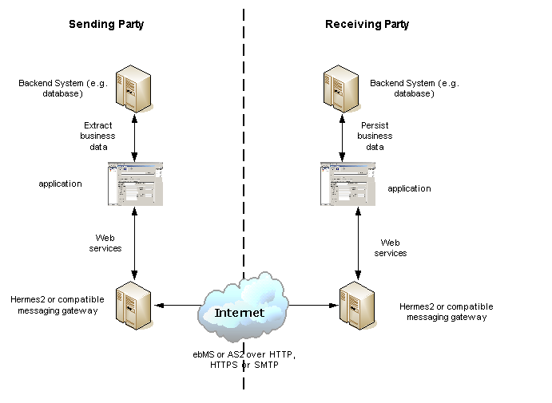

.. _application:

Implementing Hermes Applications
======================================

Introduction
------------

This document provides guidelines for developing Hermes messaging applications, which exchange messages reliably and securely with Hermes. 
A Hermes server provides web services for an application to communicate with another Hermes server. These web services allow the application to:

*  	Request Hermes to send a payload to another Hermes or a compatible messaging gateway on the receiver party;
*  	Retrieve the message identifier of a received message which has not retrieved yet;
*  	Retrieve the payloads of a message which is identified by its message identifier; and
*  	Obtain the message status of an outgoing or incoming message.

For information about installing Hermes and communicating with Hermes using an external application, please refer to :doc:`installation` and :doc:`web_service_communication`.  

General Integration Architecture
^^^^^^^^^^^^^^^^^^^^^^^^^^^^^^^^

The above figure shows a typical application integration architecture with Hermes. Two parties exchange business messages with Hermes through ebMS 2.0 or AS2 over a transport protocol, such as HTTP, HTTPS or SMTP.

On the sender side, a backend system produces business data to be transferred to the receiver party. The sender application extracts the data from the backend system and submit them to Hermes through a web service. The sender's Hermes sends the data as payloads in a business message. Then, the application invokes a web service to check whether the message is delivered successfully.

On the receiver side, Hermes receives the message. The receiver application retrieves the message from Hermes, extracts the payloads from the message, and stores them into the receiver backend system.

The application interacts with Hermes using web services, i.e., SOAP or RESTful APIs. The benefits of using web services generally apply. For example,

*  	**Implementation-independent.** Since the application interacts with Hermes using web services, the application can be implemented in any programming languages, as long as web services are supported.

*  	**Firewall-friendly.** The web services provided by Hermes use HTTP as the transport protocol. The application calls Herms with web services over HTTP; this way, persistant and stateful connectivity between Hermes and the application is not required. Even when there is a firewall between Hermes and the application, the application can communicate with Hermes as long as HTTP connections between them are not blocked. 

Prerequisites
^^^^^^^^^^^^^

The source code shown below comes the :download:`Hermes loopback test <_static/hermes2_loopback.zip>`. 
The sample code assumes that Hermes is using :samp:`localhost` with port :literal:`8080` (i.e., the default port of Tomcat).

The sample code requires the following libraries:

* :file:`activation.jar`
* :file:`mail.jar`

Import Java Packages in Web Service Client
^^^^^^^^^^^^^^^^^^^^^^^^^^^^^^^^^^^^^^^^^^
You are required to import the following Java packages to program a SOAP web service:

.. code-block:: java

   import java.net.URL;
   import java.net.MalformedURLException;
   import javax.activation.DataHandler;
   import javax.activation.FileDataSource;
   import javax.xml.soap.AttachmentPart;
   import javax.xml.soap.MessageFactory;
   import javax.xml.soap.Name;
   import javax.xml.soap.SOAPBody;
   import javax.xml.soap.SOAPConnection;
   import javax.xml.soap.SOAPConnectionFactory;
   import javax.xml.soap.SOAPElement;
   import javax.xml.soap.SOAPException;
   import javax.xml.soap.SOAPFactory;
   import javax.xml.soap.SOAPMessage;

Writing ebMS Messaging Client
=============================

Send ebMS Messages
------------------
We need to create a SOAP message with the following 10 paremeters and send it to Hermes as a web service request.

* ``cpaId``: Copllaboration Protocol Agreement ID
* ``service``: Service
* ``action``: Action
* ``convId``: Conversation ID
* ``fromPartyId``: Sender party ID
* ``fromPartyType``: Sender party type
* ``toPartyId``: Receiver party ID
* ``toPartyType``: Receiver party type
* ``refToMessageId``: Refer-to message Id
* ``serviceType``: Service type

#. Define a namespace URI and prefix conforming to the WSDL, and define the endpoint URL of the ebMS sender web service.
   
   .. code-block:: java
      
      private String nsURI = "http://service.ebms.edi.cecid.hku.hk/";
      private String nsPrefix = "tns";
      private URL senderWSURL = "http://localhost:8080/corvus/httpd/ebms/sender";

#. Create a SOAP message factory and a SOAP message object.
   
   .. code-block:: java

      SOAPMessage request = MessageFactory.newInstance().createMessage(); 

#. Populate the SOAP body by filling in the required parameters. For example:
   
   .. code-block:: xml
      
      <cpaId> ebmscpaid </cpaId>
      <service> http://localhost:8080/corvus/httpd/ebms/inbound <service>
      <action> action </action>
      <convId> convId </convId>
      <fromPartyId> fromPartyId </fromPartyId>
      <fromPartyType> fromPartyType </fromPartyType>
      <toPartyId> toPartyId </toPartyId>
      <toPartyType> toPartyType </toPartyType>
      <refToMessageId> </refToMessageId>
      <serviceType> </serviceType>
    
   Compose a sample SOAP request to send an ebMS message:
   
   .. code-block:: java
      
      SOAPBody soapBody = request.getSOAPBody();
      soapBody.addChildElement(createElement("cpaId", nsPrefix, nsURI, cpaId));
      soapBody.addChildElement(createElement("service", nsPrefix, nsURI, service));
      soapBody.addChildElement(createElement("action", nsPrefix, nsURI, action));
      soapBody.addChildElement(createElement("convId", nsPrefix, nsURI, conversationId));
      soapBody.addChildElement(createElement("fromPartyId", nsPrefix, nsURI, fromPartyId));
      soapBody.addChildElement(createElement("fromPartyType", nsPrefix, nsURI, fromPartyType));
      soapBody.addChildElement(createElement("toPartyId", nsPrefix, nsURI, toPartyId));
      soapBody.addChildElement(createElement("toPartyType", nsPrefix, nsURI, toPartyType));
      soapBody.addChildElement(createElement("refToMessageId", nsPrefix, nsURI, refToMessageId));
      soapBody.addChildElement(createElement("serviceType", nsPrefix, nsURI, serviceType));
   
   The method :code:`createElement` creates a SOAP element with the namespace prefix :code:`nsPrefix``, the namespace URL :code:`nsURI`, and the string value of the element.
   
   The implementation of ``createElement`` is shown below:
   
   .. code-block:: java
   
      SOAPElement soapElement = SOAPFactory.newInstance().createElement(localName, nsPrefix, nsURI); 
      soapElement.addTextNode(value);
      return soapElement;

#. Attach a payload to the SOAP message if necessary. The example here uses a purchase order XML as the payload, so the associated content type is :literal:`application/xml`.

   .. code-block:: java

      AttachmentPart attachmentPart = request.createAttachmentPart();
      FileDataSource fileDS = new FileDataSource(new File("purchase_order.xml"));
      attachmentPart.setDataHandler(new DataHandler(fileDS));
      attachmentPart.setContentType("application/xml");
      request.addAttachmentPart(attachmentPart); 

#. Save the changes to the SOAP message.

   .. code-block:: java
      
      request.saveChange();

#. Send the SOAP request to Hermes and get the following SOAP response.
   
   .. code-block:: java
      
      SOAPMessage response = soapConn.call(request, senderWSURL);
      SOAPBody responseBody = response.getSOAPBody();

#. Process the SOAP response, extract the identifier of the requested ebMS message, and print it to :code:`System.out` if there is no SOAP fault.
   
   .. code-block:: java
      
      if (!responseBody.hasFault()){
          SOAPElement messageIdElement = getFirstChild(responseBody, "message_id", nsURI);
          System.out.println(messageIdElement == null ? null : messageIdElement.getValue());
      } else {
          throw new SOAPException(responseBody.getFault().getFaultString());
      }

   The method :code:`getFirstChild` gets the first element with the name :code:`message_id` and the namespace URI ``nsURI``.
   An existing :code:`message_id` is a registered identifier, showing the message has been successfully submitted to Hermes.

   Hermes translates the SOAP request is now transformed into an ebMS message and saves it in its persistent storage.
   Then, the sender Hermes delivers the ebMS message to the receiver Hermes, which is specified in the SOAP request parameters, of which ``cpaId``, ``service`` and ``action`` identify the partnership between the sender and receiver.

List ebMS Messages
------------------
We need to create a SOAP message with the following 9 parameters and send it to Hermes as a web service request.

* ``cpaId``: Copllaboration Protocol Agreement ID
* ``service``: Service
* ``action``: Action
* ``convId``: Conversation ID
* ``fromPartyId``: Sender party ID
* ``fromPartyType``: Sender party type
* ``toPartyId``: Receiver party ID
* ``toPartyType``: Receiver party type
* ``numOfMessages``: Number of messages

#. Define a namespace URI and prefix conforming to the WSDL.

   .. code-block:: java

      private String nsURI = "http://service.ebms.edi.cecid.hku.hk/";
      private String nsPrefix = "tns"; 
      private String URL receiverListWSURL = "http://localhost:8080/corvus/httpd/ebms/receiver_list";

#. Create a SOAP message factory and an SOAP message object.

   .. code-block:: java

      SOAPMessage request = MessageFactory.newInstance().createMessage();

#. Populate the SOAP body by filling in the required parameters. For example:

   .. code-block:: xml

      <cpaId> ebmscpaid </cpaId>
      <service> http://localhost:8080/corvus/httpd/ebms/inbound <service>
      <action> action </action>
      <convId> convId </convId>
      <fromPartyId> fromPartyId </fromPartyId>
      <fromPartyType> fromPartyType </fromPartyType>
      <toPartyId> toPartyId </toPartyId>
      <toPartyType> toPartyType </toPartyType>
      <numOfMessages> 100 </numOfMessages>

   Compose a sample SOAP request to list ebMS messages:

   .. code-block:: java

      SOAPBody soapBody = request.getSOAPBody();
      soapBody.addChildElement(createElement("cpaId", nsPrefix, nsURI, cpaId));
      soapBody.addChildElement(createElement("service", nsPrefix, nsURI, service));
      soapBody.addChildElement(createElement("action", nsPrefix, nsURI, action));
      soapBody.addChildElement(createElement("convId", nsPrefix, nsURI, conversationId));
      soapBody.addChildElement(createElement("fromPartyId", nsPrefix, nsURI, fromPartyId));
      soapBody.addChildElement(createElement("fromPartyType", nsPrefix, nsURI, fromPartyType));
      soapBody.addChildElement(createElement("toPartyId", nsPrefix, nsURI, toPartyId));
      soapBody.addChildElement(createElement("toPartyType", nsPrefix, nsURI, toPartyType));
      soapBody.addChildElement(createElement("numOfMessages", nsPrefix, nsURI, numOfMessages));
      
   The method ``createElement`` creates a SOAP element with the namespace ``nsPrefix``, the namespace URL and the string value of the element.
   
   The implementation of ``createElement`` is shown below:

   .. code-block:: java

      SOAPElement soapElement = SOAPFactory.newInstance().createElement(localName, nsPrefix, nsURI); 
      soapElement.addTextNode(value);
      return soapElement;

#. Save changes to the SOAP message.

   .. code-block:: java
      
      request.saveChange();

#. Send the SOAP request to Hermes and get the following SOAP response.

   .. code-block:: java
      
      SOAPMessage response = soapConn.call(request, receiverListWSURL);
      SOAPBody responseBody = response.getSOAPBody();

#. Here is the SOAP response:

   .. code-block:: xml

      <soap-body>
          <messageIds>
              <messageId> ... </messageId>
              <messageId> ... </messageId>
              <messageId> ... </messageId>
              <messageId> ... </messageId>
          </messageIds>
      </soap-body>

   Process the SOAP response, extract the identifier of each requested  message, and print it to ``System.out`` if there is no SOAP fault.
   
   .. code-block:: java

      if (!responseBody.hasFault()){
          SOAPElement messageIdsElement = getFirstChild(responseBody, "messageIds", nsURI);
          Iterator messageIdElementIter = getChildren(messageIdsElement, "messageId", nsURI); 
      
          while(messageIdElementIter.hasNext()) {
              SOAPElement messageIdElement = (SOAPElement)messageIdElementIter.next();
              System.out.println(messageIdElement.getValue());
          }
      } else {
          throw new SOAPException(responseBody.getFault().getFaultString());
      }

   The method :code:`getFirstChild` gets the first element with the name :code`messageIds` and namespace :code:`nsURI`.
   It then extracts every :code:`messageId` which represents an available message awaiting a further action.

Retrieve ebMS Messages
----------------------
We need to create a SOAP message with the identifier of the target message and send it to Hermes as the web service request.

#. Define a namespace URI and prefix conforming to the WSDL.

   .. code-block:: java

      private String nsURI = "http://service.ebms.edi.cecid.hku.hk/";
      private String nsPrefix = "tns";
      private URL receiverWSURL = "http://localhost:8080/corvus/httpd/ebms/receiver";

#. Create a SOAP message factory and a SOAP message object.
   
   .. code-block:: java

      SOAPMessage request = MessageFactory.newInstance().createMessage();

#. Populate the SOAP body by filling in the required parameters.

   .. code-block:: xml
      
      <messageId> messageId </messageId>

   Compose a sample SOAP request to retrieve an ebMS message:

   .. code-block:: java
      
      SOAPBody soapBody = request.getSOAPBody();
      soapBody.addChildElement(createElement("messageId", nsPrefix, nsURI, messageId));

   The method ``createElement`` creates a SOAP element with the namespace prefix ``nsPrefix``, the namespace URL ``nsURI``, and the string value of the element.
   
   The implementation of ``createElement`` is shown below:
   
   .. code-block:: java
      
      SOAPElement soapElement = SOAPFactory.newInstance().createElement(localName, nsPrefix, nsURI); 
      soapElement.addTextNode(value);
      return soapElement;

#. Save the changes to the SOAP message.

   .. code-block:: java

      request.saveChange();

#. Send the SOAP request to Hermes and get a SOAP response.

   .. code-block:: java
      
      SOAPMessage response = soapConn.call(request, receiverWSURL);
      SOAPBody responseBody = response.getSOAPBody();

   Here is the SOAP response:
   
   .. code-block:: xml
      
      <soap-body>
          <hasMessage> ... </hasMessage>
      </soap-body>
            .
            .
      The attachment is formatted as a MIME part.

   Process the SOAP response, and extract the payloads from the received ebMS message if available.

   .. code-block:: java

      if (!responseBody.hasFault()){
          SOAPElement hasMessageElement = getFirstChild(responseBody, "hasMessage", nsURI);
          ArrayList payloadsList = new ArrayList();
          if (hasMessageElement != null){ 
              Iterator attachmentPartIter = response.getAttachments();
              while(attachmentPartIter.hasNext()) {
                  AttachmentPart attachmentPart = (AttachmentPart) attachmentPartIter.next();
                  InputStream ins = attachmentPart.getDataHandler().getInputStream();
                  // Do something I/O to extract the payload to physical file.
              }
          }
      } else {
          throw new SOAPException(responseBody.getFault().getFaultString());
      }

   The method :code:`getFirstChild` gets the first element with the name :code:`hasMessage` and the namespace URI :code:`nsURI`.
   The boolean value of ``hasMessage`` represents the existence of a payload in this message.

   The payload is extracted from the attachment part, and written to the input stream. This way, the data can be piped to a processor or saved as a file.

Get ebMS Message Status
-----------------------
We need to create a SOAP message with the identifier of the target message and send it to Hermes as the web service request.

#. Define a namespace URI and prefix conforming to the WSDL.
   
   .. code-block:: java
      
      private String nsURI = "http://service.ebms.edi.cecid.hku.hk/";
      private String nsPrefix = "tns";
      private URL statusQueryWSURL = "http://localhost:8080/corvus/httpd/ebms/status";

#. Create a SOAP message factory and a SOAP message object.
   
   .. code-block:: java
      
      SOAPMessage request = MessageFactory.newInstance().createMessage();

#. Populate the SOAP body by filling in the required parameters.
   
   .. code-block:: xml
      
      <messageId> messageId </messageId>

   Compose a sample SOAP request to get the status of an ebMS message:

   .. code-block:: java
      
      SOAPBody soapBody = request.getSOAPBody();
      soapBody.addChildElement(createElement("messageId", nsPrefix, nsURI, messageId));

   The method ``createElement`` creates a SOAP element with the namespace prefix ``nsPrefix``, the namespace URL ``nsURI`` and the string value of the element.
   
   The implementation of ``createElement`` is shown below:

   .. code-block:: java

      SOAPElement soapElement = SOAPFactory.newInstance().createElement(localName, nsPrefix, nsURI); 
      soapElement.addTextNode(value);
      return soapElement;

#. Save the changes to the SOAP message.
   
   .. code-block:: java

      request.saveChange();

#. Send the SOAP request to Hermes and get a SOAP response.

   .. code-block:: java

      SOAPMessage response = soapConn.call(request, statusQueryWSURL);
      SOAPBody responseBody = response.getSOAPBody();

#. Here is the SOAP response:
   
   .. code-block:: xml
      
      <soap-body>
          <MessageInfo>
              <status> The current status of message </status>
              <statusDescription> The current status description of message </statusDescription>
              <ackMessageId> The message id of acknowledgment / receipt if any </ackMessageId>
              <ackStatus> The status of acknowledgment / receipt if any </ackStatus>
              <ackStatusDescription> The status description of acknowledgment / receipt if any </ackStatusDescription> 
          </MessageInfo>
      </soap-body> 
   
   Process the SOAP response and extract the status information from the ebMS message if there is no SOAP fault.

   .. code-block:: java
      
      if (!responseBody.hasFault()){ 
          SOAPElement messageInfoElement = getFirstChild(responseBody, "messageInfo", nsURI);
          System.out.println("Message Status : " + getFirstChild(messageInfoElement, "status", nsURI);
          System.out.println("Message Status Desc : " + getFirstChild(messageInfoElement, "statusDescription", nsURI);
          System.out.println("Ack Message Identifiers : " + getFirstChild(messageInfoElement, "ackMessageId", nsURI);
          System.out.println("Ack Status : " + getFirstChild(messageInfoElement, "ackStatus", nsURI);
          System.out.println("Ack Status Desc : " + getFirstChild(messageInfoElement, "ackStatusDescription", nsURI); 
      } else {
          throw new SOAPException(responseBody.getFault().getFaultString());
      }

   The method :code:`getFirstChild` gets the first element with the name ``messageInfo`` and the namespace URI ``nsURI``. It then retrieves the status value from that element.

Get ebMS Message History
------------------------
We need to create a SOAP message with the following 7 parameters and send it to Hermes as a web service request.

* ``messageId``: Message ID
* ``messageBox``: Message Box
* ``conversationId``: Conversation ID
* ``cpaId``: Collaboration Protocol Agreement ID
* ``status``: Status
* ``action``: Action
* ``service``: Service

#. Define a namespace URI and prefix conforming to the WSDL.

   .. code-block:: java
         
      private String nsURI = "http://service.ebms.edi.cecid.hku.hk/";
      private String nsPrefix = "tns";
      private URL msgHistoryWSURL = "http://localhost:8080/corvus/httpd/ebms/msg_history";

#. Create a SOAP message factory and a SOAP message object.
   
   .. code-block:: java
      
      SOAPMessage request = MessageFactory.newInstance().createMessage();

#. Populate the SOAP body by filling in the required parameters.
   
   .. code-block:: xml
      
      <messageId> messageId </messageId>
      <messageBox> messageBox </messageBox>
      <conversationId> conversationId </conversationId>
      <cpaId> cpaId </cpaId>
      <service> service </service>
      <action> action </action>
      <status> status </status>

   Compose a sample SOAP request to get an ebMS message history:

   .. code-block:: java
      
      SOAPBody soapBody = request.getSOAPBody();
      soapBody.addChildElement(createElement("messageId", nsPrefix, nsURI, messageId));
      soapBody.addChildElement(createElement("messageBox", nsPrefix, nsURI, messageBox));
      soapBody.addChildElement(createElement("conversationId", nsPrefix, nsURI, conversationId));
      soapBody.addChildElement(createElement("cpaId", nsPrefix, nsURI, cpaId));
      soapBody.addChildElement(createElement("service", nsPrefix, nsURI, service));
      soapBody.addChildElement(createElement("fromPartyType", nsPrefix, nsURI, fromPartyType));
      soapBody.addChildElement(createElement("action", nsPrefix, nsURI, action));
      soapBody.addChildElement(createElement("status", nsPrefix, nsURI, status));

   The method ``createElement`` creates a SOAP element with the namespace ``nsPrefix``, the namespace URL ``nsURI``, and the string value of the element.
   
   The implementation of ``createElement`` is shown below:

   .. code-block:: java
      
      SOAPElement soapElement = SOAPFactory.newInstance().createElement(localName, nsPrefix, nsURI);
      soapElement.addTextNode(value);
      return soapElement;

#. Save the changes to the SOAP message.

   .. code-block:: java
      
      request.saveChange();

#. Send the SOAP request to Hermes and get the following SOAP response.
   
   .. code-block:: java

      SOAPMessage response = soapConn.call(request, msgHistoryWSURL);
      SOAPBody responseBody = response.getSOAPBody(); 

#. Here is the SOAP response:
   
   .. code-block:: xml
      
      <soap-body> 
          <messageList>
              <messageElement>
                  <messageId> Message ID of this message </messageId>
                  <messageBox> Message Box containing this message </messageBox>
              </messageElement>
              <messageElement>
                  <messageId> Message ID of this message </messageId>
                  <messageBox> Message Box containing this message </messageBox>
              </messageElement> 
              <messageElement> ... </messageElement> 
              <messageElement> ... </messageElement> 
          </messageList> 
      </soap-body>

   Process the SOAP response and iterate through the message history if there is no SOAP fault.

   .. code-block:: java

      if (!responseBody.hasFault()){ 
          SOAPElement msgList = SOAPUtilities.getElement(responseBody, "messageList", nsURI, 0); 

          Iterator msgIterator = msgList.getChildElements(); 
          while(msgIterator.hasNext()){ 

              List elementList = new ArrayList(); 

              SOAPElement messageElement = (SOAPElement)msgIterator.next(); 

              Iterator elements = messageElement.getChildElements(); 

              // MessageId 
              SOAPElement msgId = (SOAPElement)(elements.next()); 

              // MessageBox 
              SOAPElement msgBox = (SOAPElement)(elements.next()); 

              System.out.println("Message ID: " + (String)msgId.get(0) + "\t" + "Message Box: " + msgBox.get(0)); 
          } 
      }
   
   The method :code:`getElement` gets the element with the name :code:`messageList` and namespace URI :code`nsURI`. Then, a list of :code:`messageElement` objects is extracted from :code:`messageList`.
   Each :code:`messageElement` object contains the values of :code:`messageId` and :code:`messageBox`.

Writing AS2 Messaging Client
============================

Send AS2 Messages
-----------------
We need to create a SOAP message with the following from 3 parameters and send them to Hermes as a web service request. 

* ``as2_from``: AS2 sender
* ``as2_to``: AS2 receiver
* ``type``: Payload content type

#. Define a namespace URI and a prefix conforming to the WSDL.
   
   .. code-block:: java
      
      private String nsURI = "http://service.as2.edi.cecid.hku.hk/"; 
      private String nsPrefix = "tns"; 
      private URL senderWSURL = "http://localhost:8080/corvus/httpd/as2/sender";

#. Create a SOAP message factor and a SOAP message object.
   
   .. code-block:: java
      
      SOAPMessage request = MessageFactory.newInstance().createMessage();

#. Populate the SOAP body by filling in the required parameters.
   
   .. code-block:: xml
      
      <as2_from> as2from </as2_from>
      <as2_to> as2to <as2_to>
      <type> type </type>

   Compose a sample SOAP request to send an AS2 message:

   .. code-block:: java
      
      SOAPBody soapBody = request.getSOAPBody(); 
      soapBody.addChildElement(createElement("as2_from", nsPrefix, nsURI, this.as2From)); 
      soapBody.addChildElement(createElement("as2_to" , nsPrefix, nsURI, this.as2To)); 
      soapBody.addChildElement(createElement("type" , nsPrefix, nsURI, this.type));

   The method ``createElement`` creates a SOAP element with the namespace prefix ``nsPrefix``, the namespace URL ``nsURI``, and the string value of the element.
   
   The implementation of ``createElement`` is shown below:

   .. code-block:: java
      
      SOAPElement soapElement = SOAPFactory.newInstance().createElement(localName, nsPrefix, nsURI); 
      soapElement.addTextNode(value); 
      return soapElement;

#. Attach a payload if necessary. The following example uses a purchase order XML as the payload of the AS2 message, so the associated content type is ``application/xml``.
   
   .. note::
      Only *one* payload is allowed in the SOAP request for an AS2 message.

   .. code-block:: java
      
      AttachmentPart attachmentPart = request.createAttachmentPart(); 
      FileDataSource fileDS = new FileDataSource(new File("purchase_order.xml")); 
      attachmentPart.setDataHandler(new DataHandler(fileDS)); 
      attachmentPart.setContentType("application/xml"); 
      request.addAttachmentPart(attachmentPart);

#. Save the changes to the SOAP message.

   .. code-block:: java
      
      request.saveChange();

#. Send the SOAP request to Hermes and get the following SOAP response.
   
   .. code-block:: java
      
      SOAPMessage response = soapConn.call(request, senderWSURL); 
      SOAPBody responseBody = response.getSOAPBody();

#. Process the SOAP response and extract the identifier of the AS2 message, and print it to ``System.out`` if there is no SOAP fault.

   .. code-block:: java
      
      if (!responseBody.hasFault()){ 
          SOAPElement messageIdElement = getFirstChild(responseBody, "message_id", nsURI); 
          System.out.println(messageIdElement == null ? null : messageIdElement.getValue()); 
      } else { 
          throw new SOAPException(responseBody.getFault().getFaultString()); 
      }
   
   The method :code:`getFirstChild` gets the first element with the name :code:`message_id` and the namespace URI :code:`nsURI`.

   The sender Hermes translates The SOAP request into an AS2 message stored in the file system, and then delivers the message to the receiver Hermes specified in the SOAP request parameters, of which ``AS2From`` and ``AS2To`` identify the partnership between the sender and the receiver.

List AS2 Messages
-----------------
We need to create a SOAP message with the following 3 parameters.

* ``as2From``: AS2 sender
* ``as2To``: AS2 receiver
* ``numOfMessages``: Number of messsages

#. Define a namespace URI and a prefix conforming to the WSDL.

   .. code-block:: java
      
      private String nsURI = "http://service.as2.edi.cecid.hku.hk/";
      private String nsPrefix = "tns";
      private URL receiverListWSURL = "http://localhost:8080/corvus/httpd/as2/receiver_list";

#. Create a SOAP message factory and a SOAP message object.
   
   .. code-block:: java
      
      SOAPMessage request = MessageFactory.newInstance().createMessage();

#. Populate the SOAP body by filling in the required parameters.

   .. code-block:: xml
      
      <as2_from> as2from </as2_from>
      <as2_to> as2to <as2_to>
      <numOfMessages> 100 </numOfMessages>
   
   Compose a sample SOAP request to list AS2 messages:

   .. code-block:: java
      
      SOAPBody soapBody = request.getSOAPBody();
      soapBody.addChildElement(createElement("as2From" , nsPrefix, nsURI, this.as2From));
      soapBody.addChildElement(createElement("as2To" , nsPrefix, nsURI, this.as2To));
      soapBody.addChildElement(createElement("numOfMessages", nsPrefix, nsURI, this.numOfMessages + ""));

   The method :code:`createElement` creates a SOAP element with the namespace prefix :code:`nsPrefix`, the namespace URL :code:`nsURI` and the string value of the element.
   
   The implementation of ``createElement`` is shown below: 
   
   .. code-block:: java
      
      SOAPElement soapElement = SOAPFactory.newInstance().createElement(localName, nsPrefix, nsURI); 
      soapElement.addTextNode(value);
      return soapElement;

#. Save the changes to the SOAP message.

   .. code-block:: java
      
      request.saveChange();

#. Send the SOAP request to Hermes and get the following SOAP response.

   .. code-block:: java
      
      SOAPMessage response = soapConn.call(request, senderWSURL);
      SOAPBody responseBody = response.getSOAPBody();

   Here is the SOAP response:
   
   .. code-block:: xml
      
      <soap-body>
          <messageIds>
              <messageId> ... </messageId>
              <messageId> ... </messageId>
              <messageId> ... </messageId>
              <messageId> ... </messageId>
          </messageIds>
      </soap-body> 
   
   Process the SOAP response and extract the identifiers of the AS2 messages to ``System.out`` if there is no SOAP fault.
   
   .. code-block:: java
      
      if (!responseBody.hasFault()){
          SOAPElement messageIdsElement = getFirstChild(responseBody, "messageIds", nsURI);
          Iterator messageIdElementIter = getChildren(messageIdsElement, "messageId", nsURI); 

          while(messageIdElementIter.hasNext()) {
              SOAPElement messageIdElement = (SOAPElement)messageIdElementIter.next();
              System.out.println(messageIdElement.getValue());
          }
      } else {
          throw new SOAPException(responseBody.getFault().getFaultString());
      }
   
   The method :code:`getFirstChild` gets the first element with the name :code:`messageIds` and the namespace URI :code:`nsURI`.
   All children with the name :code:`messageId` and the namespace URI :code:`nsURI` are then extracted.

Retrieve AS2 Messages
---------------------
We need to create a SOAP message with the identifier of the target message and send it to Hermes as the web service request.

#. Define a namespace URI and a prefix conforming to the WSDL.

   .. code-block:: java

      private String nsURI = "http://service.as2.edi.cecid.hku.hk/";
      private String nsPrefix = "tns";
      private URL receiverWSURL = "http://localhost:8080/corvus/httpd/as2/receiver";

#. Create a SOAP message factory and a SOAP message object.
   
   .. code-block:: java

      SOAPMessage request = MessageFactory.newInstance().createMessage();

#. Populate the SOAP body by filling in the required parameters.

   .. code-block:: xml
      
      <messageId> messageId </messageId>

   Compose a sample SOAP request to retrieve an AS2 message:

   .. code-block:: java
      
      SOAPBody soapBody = request.getSOAPBody();
      soapBody.addChildElement(createElement("messageId", nsPrefix, nsURI, messageId));

   The method ``createElement`` creates a SOAP element with the namespace  ``nsPrefix``, the namespace URL ``nsURI`` and the string value of the element.
   
   The implementation of ``createElement`` is shown below:
   
   .. code-block:: java
      
      SOAPElement soapElement = SOAPFactory.newInstance().createElement(localName, nsPrefix, nsURI); 
      soapElement.addTextNode(value);
      return soapElement;

#. Save the changes to the SOAP message.

   .. code-block:: java

      request.saveChange();

#. Send the SOAP request to Hermes and get the following SOAP response.

   .. code-block:: java
      
      SOAPMessage response = soapConn.call(request, receiverWSURL);
      SOAPBody responseBody = response.getSOAPBody();

#. Here is the SOAP response:
   
   .. code-block:: xml
      
      <soap-body>
          <hasMessage> ... </hasMessage>
      </soap-body>
            
   The attachment is formatted as a MIME part.

   Process the SOAP response and extract the payload from the AS2 message if available.

   .. code-block:: java

      if (!responseBody.hasFault()){
          SOAPElement hasMessageElement = getFirstChild(responseBody, "hasMessage", nsURI);
          ArrayList payloadsList = new ArrayList();
          if (hasMessageElement != null){ 
              Iterator attachmentPartIter = response.getAttachments();
              while(attachmentPartIter.hasNext()) {
                  AttachmentPart attachmentPart = (AttachmentPart) attachmentPartIter.next();
                  InputStream ins = attachmentPart.getDataHandler().getInputStream();
                  // Do something I/O to extract the payload to physical file.
              }
          }
      } else {
          throw new SOAPException(responseBody.getFault().getFaultString());
      }

   The method :code:`getFirstChild` gets the first element with the name :code:`hasMessage` and namespace URI :code:`nsURI`.
   The boolean value of :code:`hasMessage` represents the existence of a payload in this message.

   The payload is extracted from the attachment part and sent to the input stream. The data can be piped to a processor or saved into a file.

Get AS2 Message Status
----------------------
We need to create a SOAP message with the identifier of the target message and send it to Hermes as a web service request.

#. Define a namespace URI and a prefix conforming to the WSDL.
   
   .. code-block:: java
      
      private String nsURI = "http://service.as2.edi.cecid.hku.hk/";
      private String nsPrefix = "tns";
      private URL statusQueryWSURL = "http://localhost:8080/corvus/httpd/as2/status";

#. Create a SOAP message factory and a SOAP message object.
   
   .. code-block:: java
      
      SOAPMessage request = MessageFactory.newInstance().createMessage();

#. Populate the SOAP body by filling in the required parameters.
   
   .. code-block:: xml
      
      <messageId> messageId </messageId>

   Compose a sample SOAP request to get the status of an AS2 message:

   .. code-block:: java
      
      SOAPBody soapBody = request.getSOAPBody();
      soapBody.addChildElement(createElement("messageId", nsPrefix, nsURI, messageId));

   The method :code:`createElement` creates a SOAP element with the namespace prefix :code`nsPrefix`, the namespace URL :code:`nsURI` and the string value of the element.
   
   The implementation of ``createElement`` is shown below:

   .. code-block:: java
      
      SOAPElement soapElement = SOAPFactory.newInstance().createElement(localName, nsPrefix, nsURI); 
      soapElement.addTextNode(value);
      return soapElement;

#. Save the changes to the SOAP message.
   
   .. code-block:: java
      
      request.saveChange();

#. Send the SOAP request to get the status of an AS2 message and get the following SOAP response.
   
   .. code-block:: java

      SOAPMessage response = soapConn.call(request, statusQueryWSURL);
      SOAPBody responseBody = response.getSOAPBody();

#. Here is the SOAP response:
   
   .. code-block:: xml
      
      <soap-body>
          <MessageInfo>
              <status> The current status of message </status>
              <statusDescription> The current status description of message </statusDescription>
              <mdnMessageId> The message id of acknowledgment / receipt if any </mdnMessageId>
              <mdnStatus> The status of acknowledgment / receipt if any </mdnStatus>
              <mdnStatusDescription> The status description of acknowledgment / receipt if any </mdnStatusDescription> 
          </MessageInfo> 
      </soap-body>
   
   Process the SOAP response and extract the status of the AS2 message if there is no SOAP fault.

   .. code-block:: java
      
      if (!responseBody.hasFault()){
          SOAPElement messageInfoElement = getFirstChild(responseBody, "MessageInfo", nsURI);
          System.out.println("Message Status : " + getFirstChild(messageInfoElement, "status", nsURI);
          System.out.println("Message Status Desc : " + getFirstChild(messageInfoElement, "statusDescription", nsURI);
          System.out.println("Ack Message Identifiers : " + getFirstChild(messageInfoElement, "mdnMessageId", nsURI);
          System.out.println("Ack Status : " + getFirstChild(messageInfoElement, "mdnStatus", nsURI);
          System.out.println("Ack Status Desc : " + getFirstChild(messageInfoElement, "mdnStatusDescription", nsURI); 
      } else { 
          throw new SOAPException(responseBody.getFault().getFaultString());
      }

   The method :code:`getFirstChild` gets the first element with the name :code:`MessageInfo` and the namespace URI :code:`nsURI`.

Get AS2 Message History
-----------------------
We need to create a SOAP message with the following 5 parameters and send it to Hermes as the web service request.

* ``messageId``: Message ID
* ``messageBox``: Message box
* ``as2From``: AS2 sender
* ``as2To``: AS2 receiver
* ``status``: Status

#. Define the namespace URI and a prefix conforming to the WSDL.
   
   .. code-block:: java
      
      private String nsURI = "http://service.as2.edi.cecid.hku.hk/";
      private String nsPrefix = "tns";
      private URL msgHistoryWSURL = "http://localhost:8080/corvus/httpd/as2/msg_history";

#. Create a SOAP message factory and a SOAP message object.

   .. code-block:: java
      
      SOAPMessage request = MessageFactory.newInstance().createMessage();

#. Populate the SOAP body by filling in the required parameters.
   
   .. code-block:: xml
      
      <messageId> messageId </messageId>
      <messageBox> messageBox </messageBox>
      <as2From> as2From </as2From>
      <as2To> as2To </as2To>
      <status> status </status>

   Compose a sample SOAP request to get an AS2 message history:

   .. code-block:: java
      
      SOAPBody soapBody = request.getSOAPBody();
      soapBody.addChildElement(createElement("messageId", nsPrefix, nsURI, messageId));
      soapBody.addChildElement(createElement("messageBox", nsPrefix, nsURI, messageBox));
      soapBody.addChildElement(createElement("as2From", nsPrefix, nsURI, cpaId));
      soapBody.addChildElement(createElement("as2To", nsPrefix, nsURI, service));
      soapBody.addChildElement(createElement("status", nsPrefix, nsURI, status));

   The method :code:`createElement` creates a SOAP element with the namespace prefix :code:`nsPrefix`, the namespace URL :code:`nsURI`, and the string value of the element.
   
   The implementation of ``createElement`` is shown below:

   .. code-block:: java
      
      SOAPElement soapElement = SOAPFactory.newInstance().createElement(localName, nsPrefix, nsURI); 
      soapElement.addTextNode(value);
      return soapElement;

#. Save the changes to the SOAP message. 
   
   .. code-block:: java
      
      request.saveChange();

#. Send the SOAP request to Hermes to get an AS2 message history and get a SOAP response.
   
   .. code-block:: java
      
      SOAPMessage response = soapConn.call(request, receiverListWSURL);
      SOAPBody responseBody = response.getSOAPBody();

   Here is the SOAP response.
   
   .. code-block:: xml
      
      <soap-body>
          <messageList>
              <messageElement>
                  <messageId> Message ID of this message </messageId>
                  <messageBox> Message Box containing this message </messageBox>
              </messageElement>
              <messageElement>
                  <messageId> Message ID of this message </messageId>
                  <messageBox> Message Box containing this message </messageBox>
              </messageElement> 
              <messageElement> ... </messageElement> 
              <messageElement> ... </messageElement> 
          </messageList> 
      </soap-body>
   
   Process the SOAP response and iterate through the AS2 message history if there is no SOAP fault.
   
   .. code-block:: java
      
      if (!responseBody.hasFault()){
          SOAPElement msgList = SOAPUtilities.getElement(responseBody, "messageList", nsURI, 0); 

          Iterator msgIterator = msgList.getChildElements();
          while(msgIterator.hasNext()){ 

              List elementList = new ArrayList(); 

              SOAPElement messageElement = (SOAPElement)msgIterator.next(); 

              Iterator elements = messageElement.getChildElements(); 

              // MessageId
              SOAPElement msgId = (SOAPElement)(elements.next()); 

              // MessageBox
              SOAPElement msgBox = (SOAPElement)(elements.next()); 

              System.out.println("Message ID: " + (String)msgId.get(0) + "\t" + "Message Box: " + msgBox.get(0));
          }
      }

   The method :code:`getElement` gets the element with the name :code:`messageList` and the namespace URI :code:`nsURI`. The :code:`messageElement` objects are extracted from the :code:`messageList` object. Each :code:`messageElement` object contains the values of :code:`messageId` and :code:`messageBox`.

See Also
========
* :doc:`first_step`
* :doc:`installation`
* :doc:`web_service_communication`
* :doc:`ebms_partnership`
* :doc:`as2_partnership`
* `OASIS ebMS 2.0 Specification <http://www.oasis-open.org/committees/ebxml-msg/documents/ebMS_v2_0.pdf>`_
* `AS2 Specification <https://tools.ietf.org/html/rfc4130>`_

Reference Program Source
========================
* :download:`Hermes loopback test <_static/hermes2_loopback.zip>`
