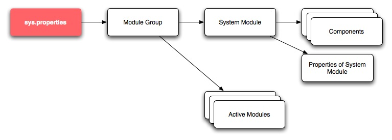
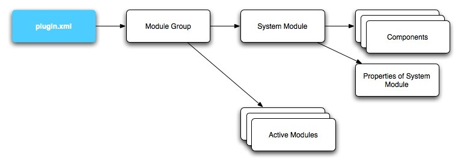

.. _configuration:

Hermes 2 Configuration Guide
============================

Introduction
------------

Purpose of this document
^^^^^^^^^^^^^^^^^^^^^^^^

This document acts as a configuration reference for Hermes 2.0 Community Edition (CE) and Enterprise Edition (EE). The configurations of Hermes 2.0 are specified by various XML-based configuration files. By modifying these files, administrators or developers can configure all the settings such as the location of the message database and log file locations.

Intended audience
^^^^^^^^^^^^^^^^^

The intended audience of this document includes system administrators, application developers and plugin developers of the Hermes 2.0 system. It assumes the audience has some background knowledge of the following:

*   Java 2 Standard Edition
*   XML
*   AS2
*   ebXML Messaging Services
*   Public Key Infrastructure
*   Application server compliant to Servlet 2.x specification
*   Databases

Overview on loading property files
^^^^^^^^^^^^^^^^^^^^^^^^^^^^^^^^^^

Hermes 2 has employed a module-group-component architecture where you can define your own module for each application. You can then assign a property file for each component and the Hermes 2 Core System will load them.

There are two loading mechanisms, one for the core system and one for the plugins. The two are almost identical except for their initial definitions.  

Let's take a look at how the core system modules are loaded. 

For the core system, Hermes 2 will look for the existence of a file named :file:`sys.properties` from the classpath which contains the location of the module-group definition file. E.g.,

    :file:`sys.module.group=doc-processor.module-group.xml`

From there, the system will look for the specified XML file and load up the modules specified within. The modules could be System Modules, which contain infrastructure components such as logging and database access, or they could be Active Modules, which perform business functions such as sending messages.

.. code-block:: xml

   <module id="piazza.corvus" name="Piazza Corvus" version="1.0">
     <component id="logger" name="System Logger">
       <class>hk.hku.cecid.piazza.commons.util.LoggerLog4j</class>
       <parameter name="config" 
                  value="hk/hku/cecid/piazza/corvus/core/conf/corvus.log.properties.xml" />		
       <parameter name="category" value="hk.hku.cecid.piazza" />
     </component>
   ...
   </module>

For the plugins, instead of looking for a file named :file:`sys.properties`, Hermes 2 will look for a file named :file:`plugin.xml` instead. 

From within, a parameter with the value :literal:`module-group-descriptor` will define the location of the module-group definition.

.. code-block:: xml

   <?xml version="1.0" encoding="UTF-8"?>
   <plugin
     id="hk.hku.cecid.edi.as2"
     name="Corvus AS2 Plugin"
     version="1.0.1"
     provider-name="hk.hku.cecid"
     class="hk.hku.cecid.edi.as2.AS2Processor"
   >
     <parameters>
       <parameter name="module-group-descriptor"
                  value="hk/hku/cecid/edi/as2/conf/as2.module-group.xml"/>
     </parameters>
   ...
   </plugin>

Hermes 2 core system properties
-------------------------------
You can modify the following information either through the web admin interface or by manipulating the XML configuration files directly.

The configuration files are stored in :file:`{<WEBAPPS_LOCATION>}/corvus/WEB-INF/classes/hk/hku/cecid/piazza/corvus/core/conf` (where :file:`{<WEBAPPS_LOCATION>}` is the web application repository of the application server).

+-----------------------------------------------------------------------+----------------------------------------+
| Properties                                                            | Configuration file                     |
+=======================================================================+========================================+
| 1.    Hermes 2 location                                               |                                        |
|                                                                       |                                        | 
| 2.    Plugin location for Hermes 2                                    |                                        |
|                                                                       |                                        | 
| 3.    SSL trust store information                                     |                                        |
|                                                                       |                                        | 
| 4.    HTTP/HTTPS proxy server                                         | :file:`corvus.properties.xml`          |           
|                                                                       |                                        | 
| 5.    Encoding settings for core system                               |                                        |       
|                                                                       |                                        | 
| 6.    Connection timeout settings                                     |                                        | 
+-----------------------------------------------------------------------+----------------------------------------+
| 7.    Log file location and level of logging                          | :file:`corvus.log.properties.xml`      |
+-----------------------------------------------------------------------+----------------------------------------+

Hermes 2 location
^^^^^^^^^^^^^^^^^
You can change the location of Hermes 2 by modifying this element:

.. code-block:: xml

   <corvus>
     <home>/corvus</home>
     ...
   </corvus>

+------------------------+------------------------------------------------------------------------------------------------+
| XPath                  | Expected information                                                                           |
+========================+================================================================================================+
| :code:`/corvus/home`   | The location in which Hermes 2 is installed. Note that the specified path is an absolute path. |
+------------------------+------------------------------------------------------------------------------------------------+
 
Plugin location for Hermes 2
^^^^^^^^^^^^^^^^^^^^^^^^^^^^
You can change the plugin location of Hermes 2 by modifying this element:

.. code-block:: xml

   <corvus>
     ...
     <plugin>
       ...   
       <registry>/corvus/plugins</registry>
       <descriptor>plugin.xml</descriptor>
       ...
     </plugin>
     ...
   </corvus>

+--------------------------------------+--------------------------------------------------------------------------------------------+
| XPath                                | Expected information                                                                       |
+======================================+============================================================================================+
| :code:`/corvus/plugin/registry`      | The location in which Hermes 2 plugins are installed. By default, it should be the         |
|                                      | :literal:`plugins` directory under the home directory where Hermes 2 is installed.         |
|                                      | Note that the specified path is an absolute path.                                          |
|                                      |                                                                                            |
+--------------------------------------+--------------------------------------------------------------------------------------------+
| :code:`/corvus/plugin/descriptor`    | The name of the XML file which Hermes 2 will use when loading the module-group-component.  |
+--------------------------------------+--------------------------------------------------------------------------------------------+

SSL trust store information
^^^^^^^^^^^^^^^^^^^^^^^^^^^
.. code-block:: xml

   <corvus>
     ...
       <environment>
         <properties>
             ...
           <javax.net.ssl.trustStore>/j2sdk1.4.2_04/jre/lib/security/cacerts
           </javax.net.ssl.trustStore>
           <javax.net.ssl.trustStorePassword>password
           </javax.net.ssl.trustStorePassword>
           ...
         </properties>
       <environment>
   </corvus>

+-------------------------------------------------------------------------+----------------------------------------------------------------------------+
| XPath                                                                   | Expected information                                                       |
+=========================================================================+============================================================================+
| :code:`/corvus/environment/properties/javax.net.ssl.trustStore`         | The location of the Java keystore which is used for                        |
|                                                                         | establishing SSL connections. The keystore should contain                  |
|                                                                         | the certificates of trusted certificate authorities. To                    |
|                                                                         | maintain the keystore, the reader should use the                           |
|                                                                         | :program:`keytool` provided by :program:`JDK`. For more                    |
|                                                                         | information, the reader may reference                                      |
|                                                                         | http://docs.oracle.com/javase/8/docs/technotes/tools/windows/keytool.html. |
+-------------------------------------------------------------------------+----------------------------------------------------------------------------+
| :code:`/corvus/environment/properties/javax.net.ssl.trustStorePassword` | The password used to access the keystore specified above.                  |
+-------------------------------------------------------------------------+----------------------------------------------------------------------------+

HTTP/HTTPS proxy server
^^^^^^^^^^^^^^^^^^^^^^^

.. code-block:: xml

   <corvus>
     ...
       <environment>
         <properties>
           <http.proxyHost>proxy.csis.hku.hk</http.proxyHost> 
           <http.proxyPort>8282</http.proxyPort> 
           <https.proxyHost>proxy.csis.hku.hk</https.proxyHost> 
           <https.proxyPort>8282</https.proxyPort>
           ...
         </properties>
       <environment>
   </corvus>

+--------------------------------------------------------+--------------------------------------------------------------+
| XPath                                                  | Expected information                                         |
+========================================================+==============================================================+
| :code:`/corvus/environment/properties/http.proxyHost`  | The hostname or IP address of the proxy host that Hermes 2   |
|                                                        | will establish HTTP connections with for outgoing messages.  |
+--------------------------------------------------------+--------------------------------------------------------------+
| :code:`/corvus/environment/properties/http.proxyPort`  | The TCP port of the proxy server specified above.            |
|                                                        |                                                              |
+--------------------------------------------------------+--------------------------------------------------------------+
| :code:`/corvus/environment/properties/https.proxyHost` | The hostname or IP address of the proxy host that Hermes 2   |
|                                                        | will establish HTTPS connections with for outgoing messages. |
+--------------------------------------------------------+--------------------------------------------------------------+
| :code:`/corvus/environment/properties/https.proxyPort` | The TCP port of the proxy server specified above.            |
|                                                        |                                                              |
+--------------------------------------------------------+--------------------------------------------------------------+

Encoding settings for core system
^^^^^^^^^^^^^^^^^^^^^^^^^^^^^^^^^

.. code-block:: xml

   <corvus>
     ...
       <encoding>
         <servlet-request>UTF-8</servlet-request>
         <servlet-response>text/html;UTF-8</servlet-response>
       </encoding>
     ...
   </corvus>

+-------------------------------------------+-----------------------------------------------------------------------------------------+
| XPath                                     | Expected information                                                                    |
+===========================================+=========================================================================================+
| :code:`/corvus/encoding/servlet-request`  | The encoding of incoming HTTP or HTTPS requests.                                        |
|                                           | :literal:`UTF-8` is the recommended value because it can handle most written languages. |
+-------------------------------------------+-----------------------------------------------------------------------------------------+
| :code:`/corvus/encoding/servlet-response` | The encoding of outgoing HTTP or HTTP responses.                                        |
+-------------------------------------------+-----------------------------------------------------------------------------------------+

Connection timeout settings
^^^^^^^^^^^^^^^^^^^^^^^^^^^
.. code-block:: xml

   <corvus>
       ...
     <properties>
       ...
       <sun.net.client.defaultConnectTimeout>30000</sun.net.client.defaultConnectTimeout>
       <sun.net.client.defaultReadTimeout>300000</sun.net.client.defaultReadTimeout>
       ...
     </properties>
     ...
   </corvus>

+----------------------------------------------------------------+--------------------------------------------------------------------+
| XPath                                                          | Expected information                                               |
+================================================================+====================================================================+
| :code:`/corvus/properies/sun.net.client.defaultConnectTimeout` | It specifies the timeout (in milliseconds) for establishing HTTP   |
|                                                                | or HTTPS connections for outgoing messages. :literal:`30` seconds  |
|                                                                | is the recommended value.                                          |
+----------------------------------------------------------------+--------------------------------------------------------------------+
| :code:`/corvus/properies/sun.net.client.defaultReadTimeout`    | It specifies the timeout (in milliseconds) for reading from input  |
|                                                                | streams when a HTTP or HTTPS connection is established.            |
|                                                                | :literal:`300` seconds is the recommended value.                   |
|                                                                |                                                                    |
+----------------------------------------------------------------+--------------------------------------------------------------------+

Log file location and level of logging
^^^^^^^^^^^^^^^^^^^^^^^^^^^^^^^^^^^^^^
To change the settings of the log written by the core system, you will need to modify the XML file named :file:`corvus.log.properties.xml`. Configuring the logging module is the same as configuring Apache Log4j. Note that for configuring the logs of plugins, you need to edit another configuration file.

.. code-block:: xml

   <log4j:configuration debug="null" threshold="null" xmlns:log4j="http://jakarta.apache.org/log4j/">
   <appender name="corvus" class="org.apache.log4j.RollingFileAppender">     
     <param name="File" value="/corvus/corvus.log"/>     
     <param name="Encoding" value="UTF-8"/>     
     <param name="MaxFileSize" value="100KB"/>     
     <param name="MaxBackupIndex" value="1"/>     
     <layout class="org.apache.log4j.PatternLayout">       
       <param name="ConversionPattern" value="%d{yyyy-MM-dd HH:mm:ss} [%-12.12t] &lt;%-5p&gt; &lt;%m&gt;%n"/>     
     </layout>  
   </appender>
   <category additivity="true" name="hk.hku.cecid.piazza">
     <priority value="debug"/>
     <appender-ref ref="corvus"/>
   </category>
   </log4j:configuration>

+----------------------------------------------------------------------------------+------------------------------------------------------+
| XPath                                                                            | Expected information                                 |
+==================================================================================+======================================================+
| :code:`log4j/category/priority`                                                  | The log level of core system logging. The available  |
|                                                                                  | levels are ``debug``, ``info``, ``warn``, ``error``  |
|                                                                                  | and ``fatal``. If you set the value as ``debug``,    |
|                                                                                  | all logs will be printed.                            |
+----------------------------------------------------------------------------------+------------------------------------------------------+
| :code:`/log4j/category/appender-ref@ref`                                         | The name of the ``appender`` element to be used      |
|                                                                                  | for logging. The ``appender`` element specifies      |
|                                                                                  | how to generate log files. In the above example,     |
|                                                                                  | the appender named ``corvus`` is used. The           |
|                                                                                  | settings of the appender are specified by the        |
|                                                                                  | referenced ``appender`` element.                     |
|                                                                                  |                                                      |
+----------------------------------------------------------------------------------+------------------------------------------------------+
| :code:`/log4j/appender@class`                                                    | The appender specified by the ``appender``           |
|                                                                                  | configuration element. Apache Log4j provides a       |
|                                                                                  | series of appenders, such as ``RollingFileAppender`` |
|                                                                                  | and ``DailyRollingFileAppender``.                    |
+----------------------------------------------------------------------------------+------------------------------------------------------+
| :code:`/log4j/appender@name`                                                     | The name of the ``appender`` configuration element.  |
|                                                                                  | :file:`/log4j/category/appender-ref@ref` should      |
|                                                                                  | reference the ``appender`` configuration element     |
|                                                                                  | by this name.                                        |
+----------------------------------------------------------------------------------+------------------------------------------------------+
| | :code:`/log4j/appender/param[@name='File']/@value`                             | The path of the core system log from this appender.  |
| |                                                                                |                                                      |
| | (i.e. The ``value`` attribute of the ``param`` element                         |                                                      |
|   under the ``appender`` element, whose ``name`` attribute is ``File``)          |                                                      |
|                                                                                  |                                                      |
+----------------------------------------------------------------------------------+------------------------------------------------------+
| | :code:`/log4j/appender/param[@name='Encoding']/@value`                         | The encoding to be used for the log file.            |
| |                                                                                |                                                      |
| | (i.e. The ``value`` attribute of the ``param`` element under the               |                                                      |
|   ``appender`` element, whose ``name`` attribute is ``Encoding``)                |                                                      |
|                                                                                  |                                                      |
+----------------------------------------------------------------------------------+------------------------------------------------------+
| | :code:`/log4j/appender/param[@name='MaxFileSize']/@value`                      | If the size of a log file has grown to exceed this   |
| |                                                                                | limit, a new log file will be written and the        |
| | (i.e. The ``value`` attribute of the ``param`` element under the               | old log file will be backed up. An index will be     |
|   ``appender`` element, whose ``name`` attribute is ``MaxFileSize``)             | appended to the name of the old log file.            |
|                                                                                  | (e.g. :file:`corvus.log.1`).                         |
|                                                                                  |                                                      |
+----------------------------------------------------------------------------------+------------------------------------------------------+
| | :code:`/log4j/appender/param[@name='MaxBackupIndex']/@value`                   | The maximum number of log files that will be backed  |
| |                                                                                | up. For example, if it is set to 10, the maximum     |
| | (i.e. The ``value`` attribute of the ``param`` element under the               | number of backed up log files will be 10 and their   |
|   ``appender`` element, whose ``name`` attribute is ``MaxBackupIndex``)          | filenames will be :file:`{xxx}.log.1`,               |
|                                                                                  | :file:`{xxx}.log.2`, ..., :file:`{xxx}.log.10`.      |
|                                                                                  |                                                      |
+----------------------------------------------------------------------------------+------------------------------------------------------+
| :code:`/log4j/appender/layout/param[@name='ConversionPattern']/@value`           | The pattern used when writing the log file.          |
|                                                                                  |                                                      |
+----------------------------------------------------------------------------------+------------------------------------------------------+

Hermes 2 plugin properties
--------------------------

AS2 plugin
^^^^^^^^^^
In the directory :file:`{<HERMES_2_PLUGINS_LOCATION>}/hk.hku.cecid.edi.as2/conf/hk/hku/cecid/edi/as2/conf`, there are some configuration files for Hermes 2's AS2 plugin. Which configuration file you should edit depends on the property:

+----------------------------------------------------+----------------------------------------+
| Properties                                         | Configuration file                     |
+====================================================+========================================+
| Log file location and level of logging             | :file:`as2.log.properties.xml`         |
+----------------------------------------------------+----------------------------------------+
| Connection to message database                     | :file:`as2.module.core.xml`            |
+----------------------------------------------------+                                        |
| Location of keystore for signing outgoing messages |                                        |
+----------------------------------------------------+                                        |
| Location of message repository                     |                                        |
+----------------------------------------------------+----------------------------------------+

Log file location and level of logging
""""""""""""""""""""""""""""""""""""""
To change the location of the log file, you will need to modify the XML file named :file:`as2.log.properties.xml`.

    .. code-block:: xml

       <log4j:configuration debug="null" threshold="null" xmlns:log4j="http://jakarta.apache.org/log4j/">
       <appender name="as2" class="org.apache.log4j.RollingFileAppender">     
         <param name="File" value="/as2.log"/>     
         <param name="Encoding" value="UTF-8"/>     
         <param name="MaxFileSize" value="100KB"/>     
         <param name="MaxBackupIndex" value="1"/>     
         <layout class="org.apache.log4j.PatternLayout">       
         <param name="ConversionPattern" 
                value="%d{yyyy-MM-dd HH:mm:ss} [%-12.12t] &lt;%-5p&gt; &lt;%m&gt;%n"/>     
         </layout>  
       </appender>
       <category additivity="true" name="hk.hku.cecid.piazza">
         <priority value="debug"/>
         <appender-ref ref="as2"/>
       </category>
       </log4j:configuration>

+------------------------------------------------------------------------+-----------------------------------------------------------------+
| XPath                                                                  | Expected information                                            | 
+========================================================================+=================================================================+
| :code:`/log4j/category/priority`                                       | The log level of the AS2 plugin logging. The available          | 
|                                                                        | levels are ``debug``, ``info``, ``warn``, ``error`` and         |
|                                                                        | ``fatal``. If you set the value as ``debug``, all logs will be  |
|                                                                        | printed.                                                        |
+------------------------------------------------------------------------+-----------------------------------------------------------------+
| :code:`/log4j/category/appender-ref@ref`                               | The name of the ``appender`` element to be used for logging.    |
|                                                                        | The ``appender`` element specifies how to generate log          |
|                                                                        | files. In the above example, the appender named ``as2``         |
|                                                                        | is used. The settings of the appender are specified by the      |
|                                                                        | referenced :code:`appender` element.                            |
|                                                                        |                                                                 |
+------------------------------------------------------------------------+-----------------------------------------------------------------+
| :code:`/log4j/appender@class`                                          | The appender specified by this ``appender`` configuration       | 
|                                                                        | element. Apache Log4j provides a series of appenders, such as   |
|                                                                        | ``RollingFileAppender`` and ``DailyRollingFileAppender``.       |
|                                                                        |                                                                 |
+------------------------------------------------------------------------+-----------------------------------------------------------------+
| :code:`/log4j/appender@name`                                           | The name of this ``appender`` configuration element.            | 
|                                                                        | :file:`/log4j/category/appender-ref@ref` should reference the   |
|                                                                        | ``appender`` configuration element by this name.                |
|                                                                        |                                                                 |
+------------------------------------------------------------------------+-----------------------------------------------------------------+
| | :code:`/log4j/appender/param[@name='File']/@value`                   | The path of the AS2 log of this appender.                       |
| |                                                                      |                                                                 |
| | (i.e. The ``value`` attribute of the ``param`` element under the     |                                                                 |
|   ``appender`` element, whose ``name`` attribute is ``File``)          |                                                                 |
|                                                                        |                                                                 |
+------------------------------------------------------------------------+-----------------------------------------------------------------+
| | :code:`/log4j/appender/param[@name='Encoding']/@value`               | The encoding to be used for the log file.                       |
| |                                                                      |                                                                 |
| | (i.e. The ``value`` attribute of the ``param`` element under the     |                                                                 |
|   ``appender`` element, whose ``name`` attribute is ``Encoding``)      |                                                                 |
|                                                                        |                                                                 |
+------------------------------------------------------------------------+-----------------------------------------------------------------+
| | :code:`/log4j/appender/param[@name='MaxFileSize']/@value`            | If the size of a log file has grown to exceed this limit,       |
| |                                                                      | another new log file will be written and the old log file       |
| | (i.e. The ``value`` attribute of the ``param`` element under the     | will be backed up. An index will be appended to the name        |
|   ``appender`` element, whose ``name`` attribute is ``MaxFileSize``)   | of the old log file (e.g. :file:`as2.log.1`).                   |
+------------------------------------------------------------------------+-----------------------------------------------------------------+
| | :code:`/log4j/appender/param[@name='MaxBackupIndex]/@value`          | The maximum number of log files that will be backed up.         |
|                                                                        | For example, if it is set to 10, the maximum number of          |
| | (i.e. The ``value`` attribute of the ``param`` element under the     | backed up log files will be 10 and their filenames will         |
|   ``appender`` element, whose ``name`` attribute is ``MaxBackupIndex``)| be :file:`{xxx}.log.1`, :file:`{xxx}.log.2`, ...,               |
|                                                                        | :file:`{xxx}.log.10`.                                           |
+------------------------------------------------------------------------+-----------------------------------------------------------------+
| :code:`/log4j/appender/layout/param[@name='ConversionPattern']/@value` | The pattern used when writing the log file.                     |
+------------------------------------------------------------------------+-----------------------------------------------------------------+

Connection to message database
""""""""""""""""""""""""""""""

.. code-block:: xml

   <module>
   ...
   <component id="daofactory" name="AS2 DAO Factory">
     <class>
     hk.hku.cecid.piazza.commons.dao.ds.SimpleDSDAOFactory
     </class>
     <parameter name="driver" value="org.postgresql.Driver" />
     <parameter name="url" 
                value="jdbc:postgresql://localhost:5432/as2" />
     <parameter name="username" value="corvus" />
     <parameter name="password" value="corvus" />
     <parameter name="pooling" value="true" />
     <parameter name="maxActive" value="20" />
     <parameter name="maxIdle" value="10" />
     <parameter name="maxWait" value="-1" />
     <parameter name="config" 
                value="hk/hku/cecid/edi/as2/conf/as2.dao.xml" />
   </component>
   ...
   </module>

+---------------------------------------------------+-----------------------------------------------------------------------------------------------+
| XPath                                             | Expected information                                                                          |
+===================================================+===============================================================================================+
| :code:`/module/component[@id='daofactory']/class` | The Java class to use when establishing a database connection. You can select:                |
|                                                   |                                                                                               |
|                                                   | * :code:`hk.hku.cecid.piazza.commons.dao.ds.SimpleDSDAOFactory`,                              |
|                                                   |   if you want AS2 to manage the database connection pool                                      |
|                                                   |                                                                                               |
|                                                   | * :code:`hk.hku.cecid.piazza.commons.dao.ds.DataSourceDAOFactory`,                            |
|                                                   |   if you want the application server to manage the database connection pool,                  |
|                                                   |   which is accessible through the Java Naming and Directory Interface (JNDI) name.            |
|                                                   |                                                                                               |
+---------------------------------------------------+-----------------------------------------------------------------------------------------------+
| Belows are fields you need to fill in if you are using SimpleDSDAOFactory                                                                         |
+---------------------------------------------------+-----------------------------------------------------------------------------------------------+
| :code:`/module/component[@id='daofactory']/`      | The JDBC driver that should be used. The driver for Postgres is provided                      |
| :code:`parameter[@name='driver']/@value`          | by default. The driver should be placed in the directory                                      | 
|                                                   | :file:`{<TOMCAT_HOME>}/webapps/corvus/WEB-INF/lib`, where we suppose the web                  |
|                                                   | application repository is configured as :file:`{<TOMCAT_HOME>}/webapps`.                      |
+---------------------------------------------------+-----------------------------------------------------------------------------------------------+
| :code:`/module/component[@id='daofactory']/`      | The URL for establishing the database connection. Please refer to the documentation           |
| :code:`parameter[@name='url']/@value`             | of the JDBC driver for the syntax. For PostgreSQL, the syntax is                              | 
|                                                   | :file:`jdbc:postgresql://{<IP or hostname of the database>}/{<message database name for AS2>}`| 
|                                                   |                                                                                               | 
+---------------------------------------------------+-----------------------------------------------------------------------------------------------+
| :code:`/module/component[@id='daofactory']/`      | The username to connect to the database.                                                      |
| :code:`parameter[@name='username']/@value`        |                                                                                               | 
+---------------------------------------------------+-----------------------------------------------------------------------------------------------+
| :code:`/module/component[@id='daofactory']/`      | The password for the username specified.                                                      |
| :code:`parameter[@name='password']/@value`        |                                                                                               | 
+---------------------------------------------------+-----------------------------------------------------------------------------------------------+
| :code:`/module/component[@id='daofactory']/`      | The boolean value (:literal:`true`/:literal:`false`) specifying if connection                 |
| :code:`parameter[@name='pooling']/@value`         | pooling should be used.                                                                       | 
+---------------------------------------------------+-----------------------------------------------------------------------------------------------+
| :code:`/module/component[@id='daofactory']/`      | The maximum number of active threads.                                                         |
| :code:`parameter[@name='maxActive']/@value`       |                                                                                               | 
+---------------------------------------------------+-----------------------------------------------------------------------------------------------+
| :code:`/module/component[@id='daofactory']/`      | The maximum number of threads that can remains idle.                                          |
| :code:`parameter[@name='maxIdle']/@value`         |                                                                                               | 
+---------------------------------------------------+-----------------------------------------------------------------------------------------------+
| :code:`/module/component[@id='daofactory']/`      | The maximum amount of time (milliseconds) that the pool will wait (when there are no          |
| :code:`parameter[@name='maxWait']/@value`         | available connections) for a connection to be returned before throwing an                     | 
|                                                   | exception, or :literal:`-1` to wait indefinitely.                                             | 
+---------------------------------------------------+-----------------------------------------------------------------------------------------------+
| :code:`/module/component[@id='daofactory']/`      | Additional configuration files that will be used by the plugin. You should just               |
| :code:`parameter[@name='config']/@value`          | leave it as is.                                                                               | 
+---------------------------------------------------+-----------------------------------------------------------------------------------------------+
| Belows are fields you need to fill in if you are using DataSourceDAOFactory                                                                       |
+---------------------------------------------------+-----------------------------------------------------------------------------------------------+
| datasource                                        | The JNDI name of the data source for connecting to the message database,                      |
|                                                   | e.g. :code:`java:/comp/env/jdbc/as2db`                                                        | 
+---------------------------------------------------+-----------------------------------------------------------------------------------------------+

Location of keystore for signing outgoing messages
""""""""""""""""""""""""""""""""""""""""""""""""""

.. code-block:: xml

    <module id="as2.core" name="Corvus AS2" version="1.0">
    ...
    <component id="keystore-manager" name="AS2 Key Store Manager">
      <class>hk.hku.cecid.piazza.commons.security.KeyStoreManager</class>
      <parameter name="keystore-location" value="as2.p12"/>
      <parameter name="keystore-password" value="password"/>
      <parameter name="key-alias" value="corvusas2"/>
      <parameter name="key-password" value=""/>
      <parameter name="keystore-type" value="PKCS12"/>
      <parameter name="keystore-provider" 
                 value="org.bouncycastle.jce.provider.BouncyCastleProvider"/>
    </component>
    ...
    </module>

+-----------------------------------------------------------------------------------------------+--------------------------------------+
| XPath                                                                                         | Expected information                 |
+===============================================================================================+======================================+
| :code:`/module/component[@id='keystore-manager']/parameter[@name='keystore-location']/@value` | The path of the keystore for         |
|                                                                                               | signing outgoing messages.           |
+-----------------------------------------------------------------------------------------------+--------------------------------------+
| :code:`/module/component[@id='keystore-manager']/parameter[@name='keystore-password']/@value` | The password for accessing the       |
|                                                                                               | keystore.                            |
+-----------------------------------------------------------------------------------------------+--------------------------------------+
| :code:`/module/component[@id='keystore-manager]/parameter[@name='key-alias']/@value`          | The alias of the private key         |
|                                                                                               | for a digital signature.             |
+-----------------------------------------------------------------------------------------------+--------------------------------------+
| :code:`/module/component[@id='keystore-manager]/parameter[@name='key-password']/@value`       | The password protecting the          |
|                                                                                               | private key for a digital signature. |
+-----------------------------------------------------------------------------------------------+--------------------------------------+
| :code:`/module/component[@id='keystore-manager]/parameter[@name='keystore-type']/@value`      | The keystore format.                 |
|                                                                                               | It is either :literal:`PKCS12` or    |
|                                                                                               | :literal:`JKS`.                      |
+-----------------------------------------------------------------------------------------------+--------------------------------------+

Location of the message repository
""""""""""""""""""""""""""""""""""
Outgoing Repository:

.. code-block:: xml

   <module id="as2.core" name="Corvus AS2" version="1.0">
   ...
   <component id="outgoing-payload-repository" name="AS2 Outgoing Payload Repository">
   <class>
   hk.hku.cecid.edi.as2.module.PayloadRepository
   </class>
     <parameter name="location" value="/as2-outgoing-repository" />
     <parameter name="type-edi" value="application/EDIFACT" />
     <parameter name="type-x12" value="application/EDI-X12" />
     <parameter name="type-eco" value="application/edi-consent" />
     <parameter name="type-xml" value="application/XML" />
   </component>
   ...
   </module>

+-------------------------------------------------------------------+---------------------------------------------------------------------------+
| XPath                                                             | Expected information                                                      |
+===================================================================+===========================================================================+
| :code:`/module/component[id='outgoing-payload-repository']/class` | The Java class responsible for handling outgoing payload.                 |
|                                                                   | You should just leave it as is.                                           |
+-------------------------------------------------------------------+---------------------------------------------------------------------------+
| :code:`/module/component[id='outgoing-payload-repository']/`      | The directory that will store the outgoing payload.                       |
| :code:`parameter[@name='location']/@value`                        | E.g., :file:`c:\program files\hermes2\repository\as2-outgoing-repository` |
+-------------------------------------------------------------------+---------------------------------------------------------------------------+
| :code:`/module/component[id='outgoing-payload-repository']/`      | You should leave these fields as is.                                      |
| :code:`parameter[@name='type-edi]/@value`                         |                                                                           |
+-------------------------------------------------------------------+                                                                           |
| :code:`/module/component[id='outgoing-payload-repository']/`      |                                                                           |
| :code:`parameter[@name='type-x12]/@value`                         |                                                                           |
+-------------------------------------------------------------------+                                                                           |
| :code:`/module/component[id='outgoing-payload-repository']/`      |                                                                           |
| :code:`parameter[@name='type-eco]/@value`                         |                                                                           |
+-------------------------------------------------------------------+                                                                           |
| :code:`/module/component[id='outgoing-payload-repository']/`      |                                                                           |
| :code:`parameter[@name='type-xml]/@value`                         |                                                                           |
+-------------------------------------------------------------------+---------------------------------------------------------------------------+

.. code-block:: xml

   <module id="as2.core" name="Corvus AS2" version="1.0">
   ...
   <component id="incoming-payload-repository" name="AS2 Incoming Payload Repository">		
     <class>
       hk.hku.cecid.edi.as2.module.PayloadRepository
     </class>
     <parameter name="location" value="/as2-incoming-repository" />
     <parameter name="type-edi" value="application/EDIFACT" />
     <parameter name="type-x12" value="application/EDI-X12" />
     <parameter name="type-eco" value="application/edi-consent" />
     <parameter name="type-xml" value="application/XML" />
   </component>
   ...
   </module>

+-------------------------------------------------------------------+---------------------------------------------------------------------+
| XPath                                                             | Expected information                                                |
+===================================================================+=====================================================================+
| :code:`/module/component[id='incoming-payload-repository']/class` | The Java class responsible for handling incoming payloads.          |
|                                                                   | You should just leave it as is.                                     |
+-------------------------------------------------------------------+---------------------------------------------------------------------+
| :code:`/module/component[id='outgoing-payload-repository']/`      | The directory that will store the outgoing payload. E.g.,           |
| :code:`parameter[@name='location']/@value`                        | :file:`c:\program files\hermes2\repository\as2-incoming-repository` |
+-------------------------------------------------------------------+---------------------------------------------------------------------+
| :code:`/module/component[id='outgoing-payload-repository']/`      | You should leave these fields as is.                                |
| :code:`parameter[@name='type-edi]/@value`                         |                                                                     |
+-------------------------------------------------------------------+                                                                     |
| :code:`/module/component[id='outgoing-payload-repository']/`      |                                                                     |
| :code:`parameter[@name='type-x12]/@value`                         |                                                                     |
+-------------------------------------------------------------------+                                                                     |
| :code:`/module/component[id='outgoing-payload-repository']/`      |                                                                     |
| :code:`parameter[@name='type-eco]/@value`                         |                                                                     |
+-------------------------------------------------------------------+                                                                     |
| :code:`/module/component[id='outgoing-payload-repository']/`      |                                                                     |
| :code:`parameter[@name='type-xml]/@value`                         |                                                                     |
+-------------------------------------------------------------------+---------------------------------------------------------------------+

Original Message Repository (a temporary message repository used when Hermes 2 is composing or receiving AS2 messages):

.. code-block:: xml

   <module id="as2.core" name="Corvus AS2" version="1.0">
   ...
   <component id="original-message-repository" name="AS2 Original Message Repository">		
     <class>
       hk.hku.cecid.edi.as2.module.MessageRepository
     </class>
       <parameter name="location" value="/as2-message-repository" />
       <parameter name="is-disabled" value="false" />
   </component>
   ...
   </module>

+-------------------------------------------------------------------+----------------------------------------------------------------------+
| XPath                                                             | Expected information                                                 |
+===================================================================+======================================================================+
| :code:`/module/component[id='original-payload-repository']/class` | The Java class responsible for handling original messages.           |
|                                                                   | You should just leave it as is.                                      |
+-------------------------------------------------------------------+----------------------------------------------------------------------+
| :code:`location`                                                  | The directory that will store outgoing payloads. E.g.,               |
|                                                                   | :file:`c:\program files\hermes2\repository\as2-message-repository`   |
+-------------------------------------------------------------------+----------------------------------------------------------------------+
| :code:`is-disabled`                                               | This flag indicates if the original message should be stored locally.|
+-------------------------------------------------------------------+----------------------------------------------------------------------+

ebMS plugin
^^^^^^^^^^^
In the directory :file:`{<HERMES_2_PLUGINS_LOCATION>}/hk.hku.cecid.ebms/conf/hk/hku/cecid/ebms/spa/conf`, there are some configuration files for Hermes 2's ebMS plugin. The configuration file you should edit depends on the property:

+------------------------------------------------------------------+----------------------------------------+
| Properties                                                       | Configuration file                     |
+==================================================================+========================================+
| Log file location and level of logging                           | :file:`ebms.log.properties.xml`        |
+------------------------------------------------------------------+----------------------------------------+
| Connections to message database                                  | :file:`ebms.module.xml`                |
+------------------------------------------------------------------+                                        |
| Location of keystore for signing outgoing messages               |                                        |
+------------------------------------------------------------------+                                        |
| Location of keystore for S/MIME decryption (incoming messages)   |                                        |
+------------------------------------------------------------------+----------------------------------------+

Log file location and level of logging
""""""""""""""""""""""""""""""""""""""
To change the location of the log file, you will need to modify the XML file named :file:`ebms.log.properties.xml`

.. code-block:: xml

   <log4j:configuration debug="null" threshold="null" xmlns:log4j="http://jakarta.apache.org/log4j/">
   <appender name="RollingFileAppender" class="org.apache.log4j.RollingFileAppender">     
     <param name="File" value="/as2.log"/>     
     <param name="Encoding" value="UTF-8"/>     
     <param name="MaxFileSize" value="100KB"/>     
     <param name="MaxBackupIndex" value="1"/>     
     <layout class="org.apache.log4j.PatternLayout">       
     <param name="ConversionPattern" 
            value="%d{yyyy-MM-dd HH:mm:ss} [%-12.12t] &lt;%-5p&gt; &lt;%m&gt;%n"/>     
     </layout>  
   </appender>
   <category additivity="true" name="hk.hku.cecid.piazza">
       <priority value="debug"/>
       <appender-ref ref="RollingFileAppender"/>
     </category>
   </log4j:configuration>

+------------------------------------------------------------------------+----------------------------------------------------------------+
| XPath                                                                  | Expected information                                           |
+========================================================================+================================================================+
| :code:`/log4j/category/priority`                                       | The log level of the ebMS plugin logging. The available        |
|                                                                        | levels are ``debug``, ``info``, ``warn``,                      |
|                                                                        | ``error`` and ``fatal``. If you set the value as               |
|                                                                        | ``debug``, all logs will be printed.                           |
+------------------------------------------------------------------------+----------------------------------------------------------------+
| :code:`/log4j/category/appender-ref@ref`                               | The name of the ``appender`` element to be used for logging.   |
|                                                                        | The ``appender`` element specifies how to generate log files.  |
|                                                                        | In the above example, the appender named                       |
|                                                                        | ``RollingFileAppender`` is used. The settings of the appender  |
|                                                                        | are specified by the referenced ``appender`` element.          |
+------------------------------------------------------------------------+----------------------------------------------------------------+
| :code:`/log4j/appender@class`                                          | The appender specified by this ``appender`` configuration      |
|                                                                        | element. Apache Log4j provides a series of appenders, such     |
|                                                                        | ``RollingFileAppender`` and ``DailyRollingFileAppender``.      |
+------------------------------------------------------------------------+----------------------------------------------------------------+
| :code:`/log4j/appender@name`                                           | The name of this ``appender`` configuration element.           |
|                                                                        | :file:`/category/appender-ref@ref` should reference            |
|                                                                        | the ``appender`` configuration element by this name.           |
+------------------------------------------------------------------------+----------------------------------------------------------------+
| | :code:`/log4j/appender/param[@name='File']/@value`                   | The path of the ebMS log of this appender.                     |
| |                                                                      |                                                                |
| | (i.e. The ``value`` attribute of the ``param`` element under the     |                                                                |
|   ``appender`` element, whose ``name`` attribute is ``File``)          |                                                                |
+------------------------------------------------------------------------+----------------------------------------------------------------+
| | :code:`/log4j/appender/param[@name='Encoding']/@value`               | The encoding to be used for the log file.                      |
| |                                                                      |                                                                |
| | (i.e. The ``value`` attribute of the ``param`` element under the     |                                                                |
|   ``appender`` element, whose ``name`` attribute is ``Encoding``)      |                                                                |
+------------------------------------------------------------------------+----------------------------------------------------------------+
| | :code:`/log4j/appender/param[@name='MaxFileSize']/@value`            | If the size of a log file has grown to exceed this limit,      |
| |                                                                      | another log file will be written and the old log file          |
| | (i.e. The ``value`` attribute of the ``param`` element under the     | will be backed up. An index will be appended to the name of    |
|   ``appender`` element, whose ``name`` attribute is ``MaxFileSize``)   | the old log file (e.g. :file:`ebms.log.1`).                    |
+------------------------------------------------------------------------+----------------------------------------------------------------+
| | :code:`/log4j/appender/param[@name='MaxBackupIndex']/@value`         | The maximum number of log files that will be backed up.        |
| |                                                                      | For example, if it is set to 10, the maximum number of         |
| | (i.e. The ``value`` attribute of the ``param`` element under the     | backed up log files will be 10 and their filenames will        |
|   ``appender`` element, whose ``name`` attribute is ``MaxBackupIndex``)| be :file:`{xxx}.log.1`, :file:`{xxx}.log.2`, ...,              |
|                                                                        | :file:`{xxx}.log.10`.                                          |
+------------------------------------------------------------------------+----------------------------------------------------------------+
| :code:`/log4j/appender/layout/param[@name='ConversionPattern']/@value` | The pattern used when writing the log file.                    |
+------------------------------------------------------------------------+----------------------------------------------------------------+

Connection to message database
""""""""""""""""""""""""""""""

.. code-block:: xml

   <module>
   ...
   <component id="daofactory" name="System DAO Factory">
     <class>
     hk.hku.cecid.piazza.commons.dao.ds.SimpleDSDAOFactory
     </class>
     <parameter name="driver" value="org.postgresql.Driver" />
     <parameter name="url" 
                value="jdbc:postgresql://localhost:5432/ebms" />
     <parameter name="username" value="corvus" />
     <parameter name="password" value="corvus" />
     <parameter name="pooling" value="true" />
     <parameter name="maxActive" value="20" />
     <parameter name="maxIdle" value="10" />
     <parameter name="maxWait" value="-1" />
     <parameter name="config">
             hk/hku/cecid/ebms/spa/conf/DAOMessage.xml,
             hk/hku/cecid/ebms/spa/conf/DAORepository.xml,
             hk/hku/cecid/ebms/spa/conf/DAOOutbox.xml,
             hk/hku/cecid/ebms/spa/conf/DAOInbox.xml,
             hk/hku/cecid/ebms/spa/conf/DAOMessageServer.xml,
             hk/hku/cecid/ebms/spa/conf/DAOPartnership.xml
      </parameter>
   </component>
   ...
   </module>

+---------------------------------------------------+------------------------------------------------------------------------------------------------+
| XPath                                             | Expected information                                                                           |
+===================================================+================================================================================================+
| :code:`/module/component[@id='daofactory']/class` | The Java class to use when establishing a database connection. You can select:                 |
|                                                   |                                                                                                |
|                                                   | * :code:`hk.hku.cecid.piazza.commons.dao.ds.SimpleDSDAOFactory`,                               |
|                                                   |   if you want ebMS to manage the database connection pool.                                     |
|                                                   |                                                                                                |
|                                                   | * :code:`hk.hku.cecid.piazza.commons.dao.ds.DataSourceDAOFactory`,                             |
|                                                   |   if you want the application server to manage the database connection pool,                   |
|                                                   |   which is accessible through the Java Naming and Directory Interface (JNDI) name.             |
+---------------------------------------------------+------------------------------------------------------------------------------------------------+
| Belows are fields you need to fill in if you are using SimpleDSDAOFactory                                                                          |
+---------------------------------------------------+------------------------------------------------------------------------------------------------+
| :code:`/module/component[@id='daofactory']/`      | The JDBC driver that should be used. The driver for Postgres is provided by                    |
| :code:`parameter[@name='driver']/@value`          | default. The driver should be placed in the directory                                          |
|                                                   | :file:`{<TOMCAT_HOME>}/webapps/corvus/WEB-INF/lib`, where we suppose the web                   |
|                                                   | application repository is configured as :file:`{<TOMCAT_HOME>}/webapps`.                       |
+---------------------------------------------------+------------------------------------------------------------------------------------------------+
| :code:`/module/component[@id='daofactory']/`      | The URL for establishing the database connection. Please refer to the documentation of         |
| :code:`parameter[@name='url']/@value`             | the JDBC driver for the syntax. For PostgreSQL, the syntax is                                  |
|                                                   | :file:`jdbc:postgresql://{<IP or hostname of the database>}/{<message database name for AS2>}` |
|                                                   |                                                                                                |
+---------------------------------------------------+------------------------------------------------------------------------------------------------+
| :code:`/module/component[@id='daofactory']/`      | The username to connect to the database.                                                       |
| :code:`parameter[@name='username']/@value`        |                                                                                                |
+---------------------------------------------------+------------------------------------------------------------------------------------------------+
| :code:`/module/component[@id='daofactory']/`      | The password for the username specified.                                                       |
| :code:`parameter[@name='password']/@value`        |                                                                                                |
+---------------------------------------------------+------------------------------------------------------------------------------------------------+
| :code:`/module/component[@id='daofactory']/`      | The boolean value (:literal:`true`/:literal:`false`) specifying if connection                  |
| :code:`parameter[@name='pooling']/@value`         | pooling should be used.                                                                        |
+---------------------------------------------------+------------------------------------------------------------------------------------------------+
| :code:`/module/component[@id='daofactory']/`      | The maximum number of active threads.                                                          |
| :code:`parameter[@name='maxActive']/@value`       |                                                                                                |
+---------------------------------------------------+------------------------------------------------------------------------------------------------+
| :code:`/module/component[@id='daofactory']/`      | The maximum number of threads that can remains idle.                                           |
| :code:`parameter[@name='maxIdle']/@value`         |                                                                                                |
+---------------------------------------------------+------------------------------------------------------------------------------------------------+
| :code:`/module/component[@id='daofactory']/`      | The maximum amount of time (milliseconds) that the pool will wait (when there are no           |
| :code:`parameter[@name='maxWait']/@value`         | available connections) for a connection to be returned before throwing an                      |
|                                                   | exception, or :literal:`-1` to wait indefinitely.                                              |
+---------------------------------------------------+------------------------------------------------------------------------------------------------+
| :code:`/module/component[@id='daofactory']/`      | Additional configuration files that will be used by the plugin. You should just                |
| :code:`parameter[@name='config']/@value`          | leave it as is.                                                                                |
+---------------------------------------------------+------------------------------------------------------------------------------------------------+
| Belows are fields you need to fill in if you are using DataSourceDAOFactory                                                                        |
+---------------------------------------------------+------------------------------------------------------------------------------------------------+
| datasource                                        | The JNDI name of the data source for connecting to the message database, e.g.                  |
|                                                   | :code:`java:/comp/env/jdbc/ebmsdb`                                                             |
+---------------------------------------------------+------------------------------------------------------------------------------------------------+

Location of keystore for signing outgoing messages
""""""""""""""""""""""""""""""""""""""""""""""""""

.. code-block:: xml

   <module id="ebms.main" name="Ebms Plugin" version="1.0">
   ...
   <component id="keystore-manager" name="Key Store Manager for Digital Signature">
     <class>hk.hku.cecid.piazza.commons.security.KeyStoreManager</class>
     <parameter name="keystore-location" value="ebms.p12"/>
     <parameter name="keystore-password" value="password"/>
     <parameter name="key-alias" value="CorvusEbMS"/>
     <parameter name="key-password" value="password"/>
     <parameter name="keystore-type" value="PKCS12"/>
     <parameter name="keystore-provider" 
                value="org.bouncycastle.jce.provider.BouncyCastleProvider"/>
     </component>
   ...
   </module>

+-----------------------------------------------------------------------------------------------+--------------------------------------+
| XPath                                                                                         | Expected information                 |
+===============================================================================================+======================================+
| :code:`/module/component[@id='keystore-manager']/parameter[@name='keystore-location']/@value` | The path of the keystore for         |
|                                                                                               | signing outgoing messages.           |
+-----------------------------------------------------------------------------------------------+--------------------------------------+
| :code:`/module/component[@id='keystore-manager']/parameter[@name='keystore-password']/@value` | The password for accessing the       |
|                                                                                               | keystore.                            |
+-----------------------------------------------------------------------------------------------+--------------------------------------+
| :code:`/module/component[@id='keystore-manager]/parameter[@name='key-alias']/@value`          | The alias of the private key for     |
|                                                                                               | digital signature.                   |
+-----------------------------------------------------------------------------------------------+--------------------------------------+
| :code:`/module/component[@id='keystore-manager]/parameter[@name='key-password']/@value`       | The password protecting the private  |
|                                                                                               | key for digital signature.           |
+-----------------------------------------------------------------------------------------------+--------------------------------------+
| :code:`/module/component[@id='keystore-manager]/parameter[@name='keystore-type']/@value`      | The keystore format.                 |
|                                                                                               | It is either :literal:`PKCS12` or    |
|                                                                                               | :literal:`JKS`.                      |
+-----------------------------------------------------------------------------------------------+--------------------------------------+

Location of keystore for S/MIME decryption (incoming messages)
""""""""""""""""""""""""""""""""""""""""""""""""""""""""""""""

.. code-block:: xml

   <module id="ebms.main" name="Ebms Plugin" version="1.0">
   ...
     <component id="keystore-manager-for-decryption" name="Key Store Manager for Decryption">
       <class>hk.hku.cecid.piazza.commons.security.KeyStoreManager</class>
       <parameter name="keystore-location" 
                  value="C:/Program Files/hermes2_ee/plugins/hk.hku.cecid.ebms/security/ebms.p12"/>
       <parameter name="keystore-password" value="password"/>
       <parameter name="key-alias" value="CorvusEbMS"/>
       <parameter name="key-password" value="password"/>
       <parameter name="keystore-type" value="PKCS12"/>
       <parameter name="keystore-provider" value="org.bouncycastle.jce.provider.BouncyCastleProvider"/>
     </component>
   ...
   </module>

+-----------------------------------------------------------------------------------------------+-----------------------------------------+
| XPath                                                                                         | Expected information                    |
+===============================================================================================+=========================================+
| :code:`/module/component[@id='keystore-manager']/parameter[@name='keystore-location']/@value` | The path of the keystore for decrypting |
|                                                                                               | incoming messages with S/MIME           |
|                                                                                               | encryption.                             |
+-----------------------------------------------------------------------------------------------+-----------------------------------------+
| :code:`/module/component[@id='keystore-manager']/parameter[@name='keystore-password']/@value` | The password for accessing the keystore.|
|                                                                                               |                                         |
+-----------------------------------------------------------------------------------------------+-----------------------------------------+
| :code:`/module/component[@id='keystore-manager]/parameter[@name='key-alias']/@value`          | The alias of the private key for the    |
|                                                                                               | decryption.                             |
+-----------------------------------------------------------------------------------------------+-----------------------------------------+
| :code:`/module/component[@id='keystore-manager]/parameter[@name='key-password']/@value`       | The password protecting the private key |
|                                                                                               | for digital signatures.                 |
+-----------------------------------------------------------------------------------------------+-----------------------------------------+
| :code:`/module/component[@id='keystore-manager]/parameter[@name='keystore-type']/@value`      | The keystore format.                    |
|                                                                                               | It is either :literal:`PKCS12` or       |
|                                                                                               | :literal:`JKS`.                         |
+-----------------------------------------------------------------------------------------------+-----------------------------------------+

References
----------

* Hermes 2 Application Development Guide
* Hermes 2 Technical Guide
* Hermes 2 Administration Tool User Guide
* Hermes 2 Enterprise Edition Installation Guide
* Hermes 2 GPL Edition Installation Guide
* Hermes 2 Plug-in Development Guide
* OASIS ebXML Message Service Specification 2.0
* MIME-based Secure Peer-to-Peer Business Data Interchange over the Internet Using HTTP AS2 (:file:`draft-ietf-ediint-as2-17.txt`)
