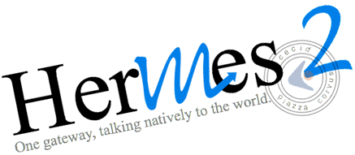

.. hermes-docs documentation master file, created by sphinx-quickstart on Thu Nov 24 11:02:00 2016.  You can adapt this file completely to your liking, but it should at least contain the root `toctree` directive.  
Hermes Messaging Gateway
========================

Introduction
------------
Each day, millions of documents and information, such as purchase orders and invoices are exchanged between business partners. When it comes to machine-to-machine document exchange, the existence of boundary between organizations is a hurdle that needs to be overcome.

EDI over Internet
^^^^^^^^^^^^^^^^^

Electronic Data Interchange (EDI) was developed as the de facto standard for organizations to exchange information electronically. However, it involves significant investment for deployment, which limits the usage to large organizations only. With the aim to broaden the user base and allow every one to enjoy the benefits of e-commerce in a lower cost and simpler manner, various public standards have emerged. Individual organizations may use different standards from that of their business partners. This generates a need to deploy several applications to support different standards being used by their business partners.

**Hermes Messaging Gateway** is developed as a platform for execution of common public standards, like ebXML Message Service (ebMS) and Application Statement 2 (AS2), to deliver a secure and reliable information transfer. Its awards-winning technologies make deployment quick and easy. What’s more, Hermes is an open-source software. That means users can use it for free and customize it to cater for their specific needs.

Download the latest open source version of Hermes Messaging Gateway 2.0 (**H2O**) source code at https://github.com/cecid/hermes. H2O, your renowed, open-source, secure business information solution. Ride on the wagon and leverage the benefits of electronic business. We have provided the installation guide and every tool you need in setting up the application properly.

One nation governs all colonies
^^^^^^^^^^^^^^^^^^^^^^^^^^^^^^^
H2O provides individual modules to handle different message protocols (e.g. AS/2, ebXML MS, etc.). Regardless of the difference of the message formats, they can all be operated simultaneously in the common H2O platform, managed by a unified environment.

.. image:: _static/images/corvus-usage.jpg

Different destinations, same vehicle
^^^^^^^^^^^^^^^^^^^^^^^^^^^^^^^^^^^^
Time is precious. Instead of learning various programs in delivering different type messages; we have standardized the programming interface for message delivery. To send an AS2 or ebXML message, your program simply invokes the corresponding endpoint provided by H2O, and you can focus on the business logic.

We are certified, to be good
^^^^^^^^^^^^^^^^^^^^^^^^^^^^
You care about quality, and so do we. Hermes 2 and the AS2 plugins have joined the 8th AS2 Interoperability Test organized by Drummond Group Inc., a US leading testing company. Hermes 2 successfully completed the AS2 Interoperability Testing with 29 other participants in the same product test round. It has also demonstrated ebXML interoperability through tests conducted with products developed by vendors and members in the ebXML Asia Committee.

.. image:: _static/images/ebusinessready.png

You plug, we converse
^^^^^^^^^^^^^^^^^^^^^
H2O provides a Simple Plug-in Architecture (SPA) specification to reduce implementation efforts for business requirements change. Quickly, the message gateway can bridge to the backend applications of an enterprise and make them converse with the world.

What's under the hood
^^^^^^^^^^^^^^^^^^^^^
H2O operates as a Java web application. The ebMS and AS2 messaging capabilities are operated by the corresponding plug-in, written according to the H2O SPA specification. The messaging operation requires a database with JDBC connectivity in keeping track of the messaging status. H2O has open endpoints, and the enterprise backend applications can invoke H2O's Web Services for message delivery. The message delivery can be secured by using SSL or e-certificates, which conforms the public standards.

.. image:: _static/images/corvus-diagram2.gif

Technical documents
-------------------
.. toctree::
   :maxdepth: 2

   installation
   configuration
   application
