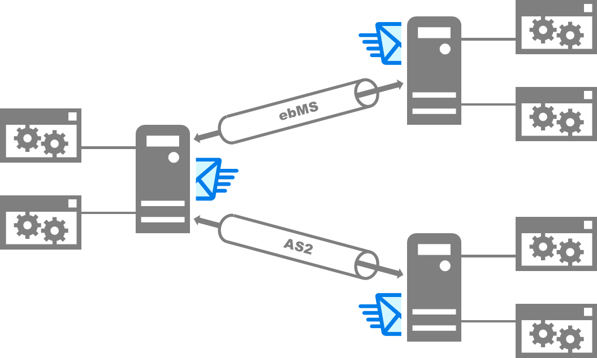

Hermes Business Messaging Gateway
=================================

Proven Solution to Automate B2B Transactions
--------------------------------------------

**Hermes Business Messaging Gateway** is a proven open-source solution
for enterprises to automate business transactions with business
partners through secure and reliable exchange of electronic documents
(e.g., purchase orders). Hermes is secure; it allows you to encrypt
and digitally sign the documents for transmission. Hermes is reliable;
the sender can automatically retransmit a message when it is dropped
in the network while the receiver can guarantee every message is
delivered once and only once, and in the right order.

EDI over the Internet
---------------------

`Electronic Data Interchange (EDI)
<https://en.wikipedia.org/wiki/Electronic_data_interchange>`_ was
developed as the de facto standard for organizations to exchange
business data. EDI is running on private networks and based on a
cryptic protocol, which makes implementation complicated, expensive,
and flexible. These disadvantages have limited the EDI usage to very
large organizations only. Hermes is designed to use the Internet,
Public Key Infrastructure (PKI), and XML technologies to replace the
EDI as a more affordable and extensible solution. Hermes supports
mainstream business-to-business (B2B) transport protocols, such as
`ebXML Message Service 2.0 (ebMS 2.0)
<https://www.oasis-open.org/committees/tc_home.php?wg_abbrev=ebxml-msg>`_
and `Applicability Statement 2 (AS2)
<http://www.ietf.org/rfc/rfc4130.txt>`_. (The `ebMS 3.0 / AS4
<https://www.oasis-open.org/committees/tc_home.php?wg_abbrev=ebxml-msg>`_
support is currently under development.).

Unified and Extensible B2B Messaging Framework
----------------------------------------------

Hermes unifies different transport protocols into a single B2B
messaging framework. Based on this framework, you can easily develop
an enterprise application to exchange business data with trading
partners via different transport protocols. Designed to be extensible,
Hermes provides an open Simple Plug-in Architecture (SPA) for
developers to implement new messaging protocols as plug-ins. Most
importantly, Hermes is open-source; you can freely extend Hermes and
integrate it with other systems to meet your own business needs.

Technical documents
-------------------
.. toctree::
   :maxdepth: 1

   quickstart
   installation
   configuration
   application
   first_step
   ebms_partnership
   as2_partnership
   web_service_communication
   web_service_usage_guide
   java_client
