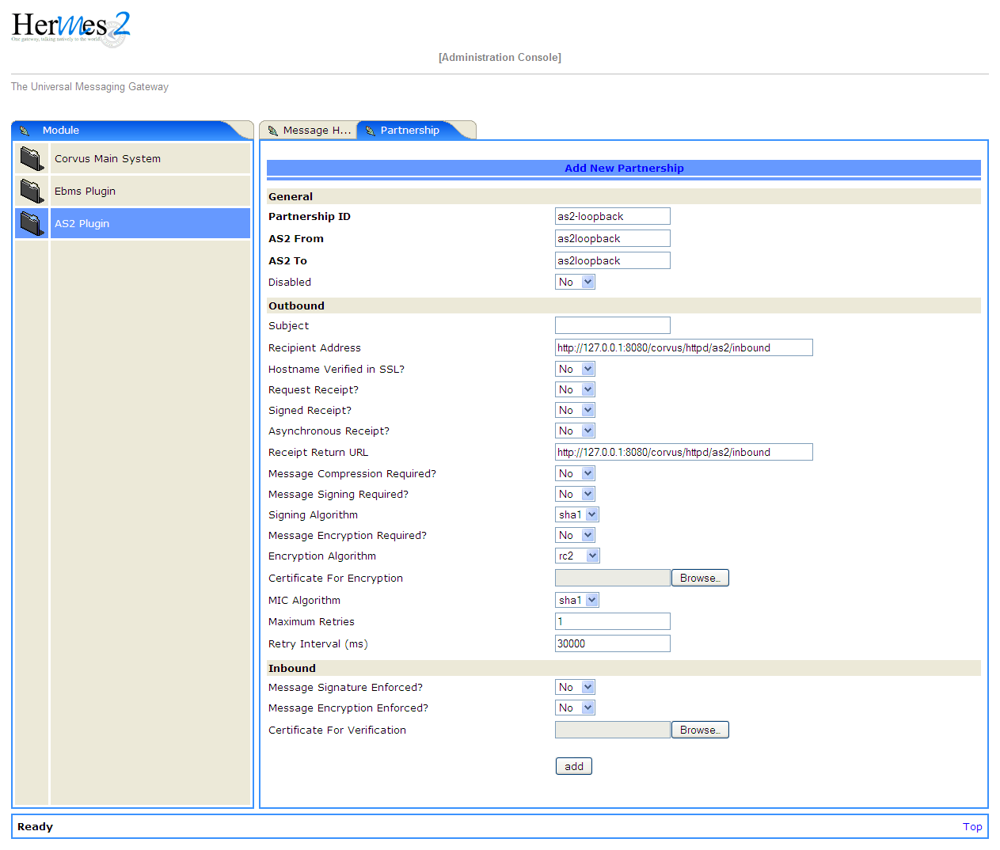

.. _installation:

Hermes 2 Installation Guide
===========================

© CECID

Produced by the Center for E-Commerce Infrastructure Development The University of Hong Kong.

The contents of this document remain the property of and may not be reproduced in whole or in part without the express permission of CECID.


Objectives of the Document
--------------------------
This document is to describe how to install and run open-source business-to-business messaging gateway Hermes 2.0 (codenamed Corvus).

Introduction
^^^^^^^^^^^^

The application is packaged in the form of a self-extracted java archive (JAR). Upon proper invocation, you will see an installation wizard, either in graphical or text format. Following through the steps will have the following components installed,

* Hermes 2 Core
* Hermes 2 plugins
* Database tables of Hermes 2 plugins for either one of the following database:
  
  * Postgres 8.0 or later
  * Oracle 9i or later
  * MySQL 5.0 or later with InnoDB storage engine supported
* Web service usage sample


Prerequisite
^^^^^^^^^^^^^^^^^
1. Java 2 SDK version 5.0 or above 
#. A security patch, Java Cryptography Extension (JCE) Unlimited Strength Jurisdiction Policy Files, is also required for the java cryptography extension. 
#. Tomcat 5.5 or above with port :literal:`8080`, :file:`{TOMCAT_HOME}` is used for referring to the home directory of tomcat in the remaining parts of document.  

   **Note:**  To access the admin page, you will need to have a Tomcat user with an admin role.  One way is to define the user in :file:`tomcat-users.xml`.  Please refer to the Realm Configuration section in the Tomcat documentation for more details.

   Sample of :file:`tomcat-user.xml`:

   .. code-block:: xml

       <?xml version='1.0' encoding='utf-8'?>
       <tomcat-users>
         <role rolename="tomcat"/>
         <role rolename="admin"/>
         <user username="corvus" password="corvus" roles="tomcat,admin"/>
       </tomcat-users>

#. One of the following database installed on any server:

  * PostgreSQL 8.0 or later, :file:`{POSTGRES_HOME}` is referring to the home directory of PostgreSQL in the remaining parts of the document.
  * MySQL 5.0 or later, :file:`{MYSQL_HOME}` is referring to the home directory of MySQL in the remaining parts of the document.
  * Oracle 9i or later, :file:`{ORACLE_HOME}` is referring to the home directory of Oracle in the remaining parts of the document.

Step 1 – Environment setup
^^^^^^^^^^^^^^^^^^^^^^^^^^
Install all the prerequisite items. It is assumed that they are all running on the same machine in the rest of this guide.

Step 2 – Configuration
^^^^^^^^^^^^^^^^^^^^^^
Database
""""""""

Postgres
````````

#. Create database user with username :literal:`corvus` and password :literal:`corvus`.

   i. Open a command prompt
   #. Go to :file:`{POSTGRES_HOME}/bin`
   #. Type :samp:`createuser -A -d -P -U {<postgres_admin>}` where :samp:`{<postgres_admin>}` representing the name of administrator / super-user in PostgreSQL database. This value is :literal:`postgres` if not specified. It may require super user or Postgres owner to execute in Linux.
   #. Create a user named :literal:`corvus`
   #. Enter the password :literal:`corvus`
   #. Enter the password again for confirmation
   #. Enter ``n`` for the question *Shall the new role be allowed to create more new roles?*
   #. Enter the PostgreSQL administrator password for creating a new user role.

#. Create two databases named :literal:`as2` and :literal:`ebms` with :literal:`corvus` user

  i. Open a command prompt
  #. Go to :file:`POSTGRES_HOME/bin`
  #. Type :samp:`createdb –U corvus –W as2`
  #. Enter the password :literal:`corvus`
  #. Repeat 2.3 - 2.4 for the :literal:`ebms` database.

MySQL
`````

1. Create two database named :literal:`as2` and :literal:`ebms` with username :literal:`corvus` and password :literal:`corvus`.

  i. Open a command prompt
  #. Go to :file:`MYSQL_HOME/bin`
  #. Type :samp:`mysql –u {<mysql_admin>} -p` where :samp:`{<mysql_admin>}` representing the name of administrator / super-user in mySQL database. This is *root* by default. It may require super user or mySQL owner to execute in Linux.
  #. Enter the command below to create the :literal:`as2` database. Notice that specifying collate to :literal:`latin1_general_cs` is essential.
    
     .. code-block:: sql

        create database as2 collate=latin1_general_cs;
     
  #. Enter the command below to create and assign access privileges to user :literal:`corvus`. 

     .. code-block:: sql

        grant all on as2.* to 'corvus'@'localhost' identified by 'corvus';
     
  #. Repeat 1.4 – 1.5 for the :literal:`ebms` database.

Oracle
``````

For Oracle database creation, since it involves a number of steps and custom parameters for different requirement for the database server. We propose the following reference for the guideline of creating an Oracle database for Hermes 2:

http://www.peacetech.com/flipper/oracle9i/901_doc/server.901/a90117/create.htm

Step 3 – Hermes 2 Deployment
^^^^^^^^^^^^^^^^^^^^^^^^^^^^

  1. In Windows platform, open a command prompt and type :samp:`java –jar hermes2_installer.jar` or if :program:`java` is not set in your environment path, specify the full path.
  #. In Unix/Linux platform, open :program:`xterm` and follow the same procedure as above.
     **Or:**
  #. In Windows platform, you can execute by double-click or right-click on the :file:`.jar` file and selecting :menuselection:`open with --> javaw` (located where you installed java, in the bin folder).
     
     .. image:: _static/images/3-4-1-hermes-2-0-opensource-installer.jpeg
  #. Click :guilabel:`next` until you get to Step 1 of the installation.
  #. Step 1 - Configure Hermes 2 Core:

     .. image:: _static/images/3-4-1-step-1-configure-hermes-2-core.png
     .. image:: _static/images/3-4-1-step-1-h2o-installer.jpeg

     Setting descriptions:

     +-----------------------------------+---------------------------------------------------------------------+
     | Web Application Folder            | Folder to place the web application (e.g :file:`webapps`) in Tomcat |
     +-----------------------------------+---------------------------------------------------------------------+
     | Hermes 2 Home                     | Location to place the Hermes 2 core library and some related files  |
     +-----------------------------------+---------------------------------------------------------------------+
     | JDBC Driver                       | Specify which database vendor to connect to                         |
     |                                   | One of these 3 database vendor can be chosen:                       |
     |                                   |                                                                     | 
     |                                   |   * Postgres                                                        |
     |                                   |   * Oracle                                                          |
     |                                   |   * MySQL                                                           |
     +-----------------------------------+---------------------------------------------------------------------+
     | Hermes 2 ebMS Plugin              | Whether to install the ebMS conponent                               |
     +-----------------------------------+---------------------------------------------------------------------+
     | Hermes 2 AS2 Plugin               | Whether to install the AS2 component                                |
     +-----------------------------------+---------------------------------------------------------------------+
     | Web Service Usage Sample          | Whether to install the sample program of web service client         |
     +-----------------------------------+---------------------------------------------------------------------+

  6. Click :guilabel:`next` and press :guilabel:`yes` if the installer prompts you to create a new directory.

  7. Step 2 - Configure Database for ebMS Plugin (Optional)
  
     .. image:: _static/images/3-4-1-step-2-configure-database-for-ebms-plugin.png
     .. image:: _static/images/3-4-1-step-2-h2o-installer.jpeg


     Setting descriptions:
     
     +-------------------+-------------------------------------------------------------------------------------------------------------------------------------------------------------------------------------------------------------------------------------------------------------------------------------+
     | Database URL      | The URL address of the database server located. Port number may attached to the address as the format :samp:`{<host_address>}:{<port>}` where :samp:`{<host_address>}` is the address of the database server and :samp:`{<port>}` is the port number of the database server address |
     +-------------------+-------------------------------------------------------------------------------------------------------------------------------------------------------------------------------------------------------------------------------------------------------------------------------------+
     | Database Name/SID | For Postgres and MySQL, please specify the name of the database. For Oracle, please specify the Oracle System ID (SID)                                                                                                                                                              |
     +-------------------+-------------------------------------------------------------------------------------------------------------------------------------------------------------------------------------------------------------------------------------------------------------------------------------+
     | Username          | Username to access database                                                                                                                                                                                                                                                         |
     +-------------------+-------------------------------------------------------------------------------------------------------------------------------------------------------------------------------------------------------------------------------------------------------------------------------------+
     | Password          | Password to access database                                                                                                                                                                                                                                                         |
     +-------------------+-------------------------------------------------------------------------------------------------------------------------------------------------------------------------------------------------------------------------------------------------------------------------------------+
     | Re-create Tables  | Whether to re-create all the table in the specified database                                                                                                                                                                                                                        | 
     |                   |                                                                                                                                                                                                                                                                                     |
     |                   |                                                                                                                                                                                                                                                                                     |
     |                   | **Important Notes:**                                                                                                                                                                                                                                                                |
     |                   |                                                                                                                                                                                                                                                                                     |
     |                   | If this is your **first time to install hermes**, please check this option.                                                                                                                                                                                                         |
     |                   |                                                                                                                                                                                                                                                                                     |
     |                   | If choose to re-create the tables, all of the existing data in the specified database will remove at the later step of installation. Please backup all the data on the selected database before choose to re-create tables.                                                         |
     |                   |                                                                                                                                                                                                                                                                                     |
     +-------------------+-------------------------------------------------------------------------------------------------------------------------------------------------------------------------------------------------------------------------------------------------------------------------------------+

  8. If you followed the prerequisite install procedures from above, you can just leave it as the default.

  9. Then click :guilabel:`next`.

  10. If AS2 Plugin was not selected, click :guilabel:`next` and then click on :guilabel:`install` and you’re done!

  11. Step 3 - Configure Database for AS2 Plugin (Optional)

      .. image:: _static/images/3-4-1-step-3-configure-database-for-as2-plugin.png
      .. image:: _static/images/3-4-1-step-3-h2o-installer.jpeg

     Setting descriptions:

     +---------------------+-------------------------------------------------------------------------------------------------------------------------------------------------------------------------------------------------------------------------------------------------------------------------------------+
     | Database URL        | The URL address of the database server located. Port number may attached to the address as the format :samp:`{<host_address>}:{<port>}` where :samp:`{<host_address>}` is the address of the database server and :samp:`{<port>}` is the port number of the database server address |
     +---------------------+-------------------------------------------------------------------------------------------------------------------------------------------------------------------------------------------------------------------------------------------------------------------------------------+
     | Database Name / SID | For Postgres and MySQL, please specify the name of the database. For Oracle, please specify the Oracle System ID (SID)                                                                                                                                                              |
     +---------------------+-------------------------------------------------------------------------------------------------------------------------------------------------------------------------------------------------------------------------------------------------------------------------------------+
     | Username            | Username to access database                                                                                                                                                                                                                                                         |
     +---------------------+-------------------------------------------------------------------------------------------------------------------------------------------------------------------------------------------------------------------------------------------------------------------------------------+
     | Password            | Password to access database                                                                                                                                                                                                                                                         |
     +---------------------+-------------------------------------------------------------------------------------------------------------------------------------------------------------------------------------------------------------------------------------------------------------------------------------+
     | AS2 Plugin          | AS2: Original AS2 plugin certified by Drummond Group Inc.                                                                                                                                                                                                                           |
     +---------------------+-------------------------------------------------------------------------------------------------------------------------------------------------------------------------------------------------------------------------------------------------------------------------------------+
     |                     | AS2 Plus: Built based on AS2 plugin with new/enhanced features.                                                                                                                                                                                                                     |
     +---------------------+-------------------------------------------------------------------------------------------------------------------------------------------------------------------------------------------------------------------------------------------------------------------------------------+
     | Re-create Tables    | Whether to re-create all the table in the specified database                                                                                                                                                                                                                        |
     |                     |                                                                                                                                                                                                                                                                                     |
     |                     |                                                                                                                                                                                                                                                                                     |
     |                     |                                                                                                                                                                                                                                                                                     |
     |                     | **Important Notes:**                                                                                                                                                                                                                                                                |
     |                     |                                                                                                                                                                                                                                                                                     |
     |                     | If this is your **first time to install hermes**, pleas check this option.                                                                                                                                                                                                          |
     |                     |                                                                                                                                                                                                                                                                                     |
     |                     | If you purposely switch your plugin from AS2 to AS2 Plus, or versus. We highly recommend you **check this option**.                                                                                                                                                                 |
     |                     |                                                                                                                                                                                                                                                                                     |
     |                     | If choose to re-create the tables, all of the existing data on the specified database will remove at the later step of installation. Please backup all the data on the selected database before choose to re-create tables.                                                         |
     +---------------------+-------------------------------------------------------------------------------------------------------------------------------------------------------------------------------------------------------------------------------------------------------------------------------------+

  12. If you followed the prerequisite install procedures from above, you can just leave it as the default.

  13. Then click :guilabel:`next` and then click on :guilabel:`install` and you're done!

Step 4 – Start Hermes 2
^^^^^^^^^^^^^^^^^^^^^^^

Check list:

1. Java 2 SDK 5.0 or above with Java Cryptography Extension (JCE) Unlimited Strength Jurisdiction Policy Files 5.0.

2. Apache Tomcat 5.5 or above Servlet/JSP Container

3. Database server is running with ebMS/AS2 database instance and tables created.

4. If you are running Unix/Linux, make sure that at least read permissions are set to the core directory and read/write for AS2 repository directory in Hermes 2 Home.

5. Start Tomcat.

6. To verify Hermes 2 is running, access the following URL from browser.

    http://localhost:8080/corvus/home

   Welcome page should be displayed as below:

   .. image:: _static/images/3-5-step-4-welcome-page.jpeg

7. To access the admin page, go to the following URL. The login user / password is the same as the Tomcat user with admin privileges specified in Section 3.2.

    http://localhost:8080/corvus/admin/home

8. Once you have gained access to the admin page, you should see the Hermes 2 Administration Console page like this:

   .. image:: _static/images/3-5-step-4-administration-console-page.png

That's it! Your Hermes 2 should now be up and running. You can test your setup by running our web service usage sample in Section!.


Partnership Maintenance and Web Service Usage Sample
-------------------------------------------------------

A tool kit called *Web Service Usage Sample* was installed under Hermes 2, :file:`{<HERMES2_HOME>}/sample` folder. It contains tools to test the installed Hermes, demonstrate messaging flow and provided a set of sample code for user to write web service client application to connect to the Hermes 2.

Directory Organization
^^^^^^^^^^^^^^^^^^^^^^

+---------------------------------------+-----------------------------------------------------------------------------------------------------------------------------------------------------+
| Directory / File                      | Description                                                                                                                                         |
+=======================================+=====================================================================================================================================================+
| :file:`config/*`                      | Contains the configuration file for the sample programs. The folders inside this directory contain related files for specific sample program.       |
+---------------------------------------+-----------------------------------------------------------------------------------------------------------------------------------------------------+
| :file:`config/ebms-partnership.xml`   | These two files contain the setting of the partnership for ebMS and AS2 commonly used by sample programs.                                           |
| and                                   |                                                                                                                                                     |
| :file:`config/as2-partnership.xml`    |                                                                                                                                                     |
+---------------------------------------+-----------------------------------------------------------------------------------------------------------------------------------------------------+
| :file:`logs/*`                        | A set of logs contains the output from each sample program.                                                                                         |
+---------------------------------------+-----------------------------------------------------------------------------------------------------------------------------------------------------+
| :file:`lib/*`                         | The library files required for the sample programs.                                                                                                 |
+---------------------------------------+-----------------------------------------------------------------------------------------------------------------------------------------------------+
| :file:`*.bat` / :file:`\*.sh`         | The scripts for executing the sample programs.                                                                                                      |
+---------------------------------------+-----------------------------------------------------------------------------------------------------------------------------------------------------+

Preparation
^^^^^^^^^^^

Windows environment
"""""""""""""""""""

1. Set environment variable :envvar:`JAVA_HOME` to the directory installed the java.

UNIX environment
""""""""""""""""

1. Set environment variable :envvar:`JAVA_HOME` to the directory installed the java.

2. Change the permission of all shell-script files to :literal:`755` by following command.
   
   .. code:: sh

      chown 755 *.sh

Partnership Maintenance
^^^^^^^^^^^^^^^^^^^^^^^

Users need to define a *Partnership*, which contains the relationship of messaging in transport level between a sender and a recipient. It is required to specify the *Partnership* in sender the recipient.

A web service sample program is provided to manage *Partnership* (to add, update or delete). The partnership configuration for AS2/ebMS loopback test is placed in :file:`{HERMES2_HOME}/sample/config/as2(ebms)-partnership.xml`.

Usage:

+------------------------------+----------------------------------------------------------+
| :program:`as2-partnership` / | Maintain a specified AS2 / ebMS partnership in Hermes 2. |
| :program:`ebms-partnership`  |                                                          |
+------------------------------+----------------------------------------------------------+

.. _4.3.1:

Creating AS2 Partnership
""""""""""""""""""""""""

To create the partnership required to perform the AS2 messaging loopback test using Web Service Usage Sample in next step, you just need to execute the command :program:`as2-partnership`.

**Or:**

Access http://localhost:8080/corvus/admin/as2/partnership to configure the partnership manually. Below is a simple loop-back configuration sample.




+-------------------------------+------------------------------------------------+
| Partnership ID                | :literal:`as2-loopback`                        |
+-------------------------------+------------------------------------------------+
| AS2 From                      | :literal:`as2loopback`                         |
+-------------------------------+------------------------------------------------+
| AS2 To                        | :literal:`as2loopback`                         |
+-------------------------------+------------------------------------------------+
| Disabled                      | :guilabel:`No`                                 |
+-------------------------------+------------------------------------------------+
| Subject                       | none                                           |
+-------------------------------+------------------------------------------------+
| Recipient Address             | http://127.0.0.1:8080/corvus/httpd/as2/inbound |
+-------------------------------+------------------------------------------------+
| Hostname Verified in SSL?     | :guilabel:`No`                                 |
+-------------------------------+------------------------------------------------+
| Request Receipt?              | :guilabel:`No`                                 |
+-------------------------------+------------------------------------------------+
| Signed Receipt?               | :guilabel:`No`                                 |
+-------------------------------+------------------------------------------------+
| Asynchronous Receipt?         | :guilabel:`No`                                 |
+-------------------------------+------------------------------------------------+
| Receipt Return URL            | http://127.0.0.1:8080/corvus/httpd/as2/inbound |
+-------------------------------+------------------------------------------------+
| Message Compression Required? | :guilabel:`No`                                 |
+-------------------------------+------------------------------------------------+
| Message Signing Required?     | :guilabel:`No`                                 |
+-------------------------------+------------------------------------------------+
| Signing Algorithm             | :guilabel:`sha1`                               |
+-------------------------------+------------------------------------------------+
| Message Encryption Required?  | :guilabel:`No`                                 |
+-------------------------------+------------------------------------------------+
| Encryption Algorithm          | :guilabel:`rc2`                                |
+-------------------------------+------------------------------------------------+
| Certificate For Encryption    | none                                           |
+-------------------------------+------------------------------------------------+
| MIC Algorithm                 | :guilabel:`sha1`                               |
+-------------------------------+------------------------------------------------+
| Maximum Retries               | :literal:`1`                                   |
+-------------------------------+------------------------------------------------+
| Retry Interval (ms)           | :literal:`30000`                               |
+-------------------------------+------------------------------------------------+
| Message Signature Enforced?   | :guilabel:`No`                                 |
+-------------------------------+------------------------------------------------+
| Message Encryption Enforced?  | :guilabel:`No`                                 |
+-------------------------------+------------------------------------------------+
| Certificate For Verification  | none                                           |
+-------------------------------+------------------------------------------------+

Creating AS2 Plus Partnership
"""""""""""""""""""""""""""""

Please reference the procedures of `Creating AS2 Partnership`_ to create AS2 Plus partnership.

Creating ebMS Partnership
"""""""""""""""""""""""""

To create the partnership required to perform the ebMS messaging loopback test using Web Service Usage Sample in next step, you need to execute the command :program:`ebms-partnership`.

**Or:**

Access http://localhost:8080/corvus/admin/ebms/partnership to configure the partnership manually. Below is a simple loop-back configuration sample.

  .. image:: _static/images/4-3-3-ebms-plugin.png

+----------------------------------+-------------------------------------------------+
| Partnership ID                   | :literal:`ebms-loopback`                        |
+----------------------------------+-------------------------------------------------+
| CPA ID                           | :literal:`cpaid`                                |
+----------------------------------+-------------------------------------------------+
| Service                          | http://localhost:8080/corvus/httpd/ebms/inbound |
+----------------------------------+-------------------------------------------------+
| Action                           | :literal:`action`                               |
+----------------------------------+-------------------------------------------------+
| Disabled                         | :guilabel:`No`                                  |
+----------------------------------+-------------------------------------------------+
| Transport Endpoint               | http://localhost:8080/corvus/httpd/ebms/inbound |
+----------------------------------+-------------------------------------------------+
| Hostname Verified in SSL?        | :guilabel:`No`                                  |
+----------------------------------+-------------------------------------------------+
| Sync Reply Mode                  | :guilabel:`none`                                |
+----------------------------------+-------------------------------------------------+
| Acknowledgement Requested        | :guilabel:`never`                               |
+----------------------------------+-------------------------------------------------+
| Acknowledgement Signed Requested | :guilabel:`never`                               |
+----------------------------------+-------------------------------------------------+
| Duplicate Elimination            | :guilabel:`never`                               |
+----------------------------------+-------------------------------------------------+
| Message Order                    | :guilabel:`NotGuaranteed`                       |
+----------------------------------+-------------------------------------------------+
| Signing Required?                | :guilabel:`No`                                  |
+----------------------------------+-------------------------------------------------+
| Encryption Required? (Mail Only) | :guilabel:`No`                                  |
+----------------------------------+-------------------------------------------------+
| Certificate For Encryption       | none                                            |
+----------------------------------+-------------------------------------------------+
| Maximum Retries                  | :literal:`1`                                    |
+----------------------------------+-------------------------------------------------+
| Retry Interval (ms)              | :literal:`30000`                                |
+----------------------------------+-------------------------------------------------+
| Certificate For Verification     | none                                            |
+----------------------------------+-------------------------------------------------+

.. _4.4:

Web Service Usage Sample Flow
^^^^^^^^^^^^^^^^^^^^^^^^^^^^^

In order to validate the installation of Hermes 2, a web service usage sample program is provided. It can be simply executed by running the following command in a command prompt.

Usage:

+--------------------------+---------------------------------------------------------------------------------------------------------------------------------------------------------------------------------------------------------------------------------------------------------------------------------------------------+
| :program:`as2-send` /    | Send a AS2 / ebMS message to the local Hermes 2. installed                                                                                                                                                                                                                                        |
| :program:`ebms-send`     |                                                                                                                                                                                                                                                                                                   |
+--------------------------+---------------------------------------------------------------------------------------------------------------------------------------------------------------------------------------------------------------------------------------------------------------------------------------------------+
| :program:`as2-history` / | Show the message history in the Hermes 2. This program will list the inbox and outbox message stored in the Hermes 2 data storage. User can view the details of inbox and outbox. For inbox message, user can also download the payload received in the Hermes 2 repository, if it is available.  |
| :program:`ebms-history`  |                                                                                                                                                                                                                                                                                                   |
+--------------------------+---------------------------------------------------------------------------------------------------------------------------------------------------------------------------------------------------------------------------------------------------------------------------------------------------+

In order to test whether the Hermes 2 are installed success or not, we suggest to run sample programs in following steps:

1. Add a partnership by running :program:`ebms-partnership` / :program:`as2-partnership`.

2. Send message to the local Hermes 2 by running :program:`ebms-send` / :program:`as2-send`.

3. Check the status of sent message by running :program:`ebms-history` / :program:`as2-history` and select the message from outbox.

4. Check the received message by running :program:`ebms-history` / :program:`as2-history` and select the message from inbox, download the payload.

AS2 Web Service Usage Sample
""""""""""""""""""""""""""""

You are required to execute `Creating AS2 Partnership`_ successfully before executing the following AS2 web service usage sample. Next we illustrate the steps to run the test described in `Web Service Usage Sample Flow`_

Send message to the local Hermes 2 using the command :program:`as2-send`.

This program creates and sends the request attached with the payload named :file:`testpayload` under the directory :file:`/config/as2-send` to Hermes2.


Upon successful execution, you should be able to see the similar output shown as follow: 

.. code-block:: none

    ----------------------------------------------------
                    AS2 Message Sender
    ----------------------------------------------------
    Initialize Logger ...
    Importing AS2 sending parameters ... ./config/as2-send/as2- request.xml
    Importing AS2 partnership parameters ... ./config/as2- partnership.xml
    Initialize AS2 message sender...
    Adding payload in the AS2 message...
    Sending AS2 sending request ...

                       Sending Done:
    ----------------------------------------------------
    New message id: 20080722-133931-01300@127.0.1.1
    Please view log for details ..

Check the sent message using the command :program:`as2-history`.

This program retrieves the list of sent/received message from Hermes 2. 

.. code-block:: none

    ----------------------------------------------------
           AS2 Message History Web Service Client
    ----------------------------------------------------
    Initialize Logger ...
    Importing AS2 config parameters ... ./config/as2-history/as2- request.xml
    Initialize AS2 messsage history queryer ...
    Sending AS2 message history query request ...
    
                        Sending Done:
    ----------------------------------------------------
               AS2 Message that are matched
    ----------------------------------------------------
    No. of message: 2
    0 | Message id : 20080722-133931-01300@127.0.1.1
    1 | Message id : 20080722-133931-01300@127.0.1.1
    MessageBox: outbox
    MessageBox: inbox
    ----------------------------------------------------
    Select message (0 - 1), -1 to exit:


Enter :literal:`0` to check the sent message, the screen silimiar as following will show: 

.. code-block:: none

    Select message (0 - 1), -1 to exit: 0
    Query Message ID          : 20080722-133931-01300@127.0.1.1 
    Query Message Status      : DL 
    Query Message Status Desc : null 
    ACK Message ID            : null 
    ACK Message Status        : null 
    ACK Message Status Desc   : null


Check the received message, download the payload

From the select message screen of :program:`as2-history`, enter 1 to select the inbox message, then it will prompt for *Please provide the folder to store the payload(s):*, press enter to save in the current folder. Then there should be a file named :file:`as2.{<timestamp>}@127.0.1.1.Payload.0`, where :file:`{<timestamp>}` is the time you just execute :program:`as2-send` before. Open that file and you will see the follow content:

  .. image:: _static/images/4-4-1-smaple-message.png

Finally, the test for AS2 plugin installation has been done after executed the above steps successfully.

ebMS Web Service Usage Sample
"""""""""""""""""""""""""""""

You are required to execute `Creating AS2 Plus Partnership`_ successfully before executing the following ebMS web service usage sample. Next we illustrate the steps to run the test described in `Web Service Usage Sample Flow`_

Send message to the local Hermes 2 server using the command :program:`ebms-send`.

This program creates and sends the request attached with the payload named :file:`testpayload` under the directory :file:`/config/ebms-send` to Hermes2.

Upon successful execution, you should be able to see the similar output shown in following:

.. code-block:: none

    ----------------------------------------------------
               EbMS sender web service client           
    ----------------------------------------------------
    Initialize Logger ...
    Importing xml
    Importing l
    ebMS sending parameters ... ./config/ebms-send/ebms-request.
    ebMS partnership parameters ... ./config/ebms-partnership.xml
    Initialize ebMS web service client...
    Adding
    Sending
    payload in the ebMS message...
    ebMS sending request ...
    
                        Sending Done:
    ----------------------------------------------------
    New message id: 20080722-143157-97302@127.0.1.1
    Please view log for details ..

Check the sent message using the command :program:`ebms-history`.

This program retrieves the list of sent/received message from Hermes 2.

.. code-block:: none

    ----------------------------------------------------
               EbMS Message History Queryer
    ----------------------------------------------------
    Initialize Logger ...
    Importing ebMS config parameters ... ./config/ebms-history/ebms-request.xml
    Initialize ebMS messsage history queryer ...
    Sending ebMS message history query request ...
    
                        Sending Done:
    ----------------------------------------------------
                 EbMS Message Query Result             
    ----------------------------------------------------
    0   | Message id : 20080722-143157-97302@127.0.1.1 | MessageBox: outbox
    1   | Message id : 20080722-143157-97302@127.0.1.1 | MessageBox: inbox
    ----------------------------------------------------
    Select message (0 - 1), -1 to exit:

Enter :literal:`0` to check the sent message, the screen similar as follow will show: 

.. code-block:: none

                        Sending Done:
    ----------------------------------------------------
    Query Message ID          : 20080722-143157-97302@127.0.1.1
    Query Message Status      : DL
    Query Message Status Desc : Message was sent.
    ACK Message ID            : null
    ACK Message Status        : null
    ACK Message Status Desc   : null
    ----------------------------------------------------
    Please view log for details..

Check the received message, download the payload

From the select message screen of :program:`ebms-history`, enter :literal:`1` to select the inbox message, then it will prompt for *Please provide the folder to store the payload(s):*, press enter to save in the current folder. Then there should a file named :file:`ebms.{<timestamp>}@127.0.1.1.Payload.0`, where :file:`{<timestamp>}` is the time you just execute :program:`ebms-send` before. Open that file and you will see the following content:

Finally, the test for ebMS plugin installation has been done after executed the above steps successfully.

  .. image:: _static/images/4-4-1-smaple-message.png


Configuration for Secure Messaging & Secure Channel
---------------------------------------------------

In order to store private key for message signing, keystore is needed. Under current implementation, only PKCS12 keystore is supported. If you are running Hermes Installer, there are keystore files put under folder called :file:`security` under both ebMS and AS2/AS2 Plus plugins.

Message Signing
^^^^^^^^^^^^^^^

To enable message signing, please configure the plugin with corresponding keystore. A default keystore setting are set through the installer. Or make a new customized keystore. To learn more about generating a keystore, please refer to article about `Generate Certificate`__.

__ http://community.cecid.hku.hk/index.php/product/article/configuration_for_message_signning_and_secure_channel/#generate_cert

Sender Setting for Message Signing
""""""""""""""""""""""""""""""""""

To instruct Hermes to perform message signing with correct private-key, the corresponding Keystore Manager should be configured with correct parameters.

ebMS Sender-SideSetting
```````````````````````

Open the configuration file named :file:`ebms.module.xml` which is placed in the :file:`conf` folder of ebMS plugin. A component named :code:`keystore-manager-for-signature` is defined to manage the keystore.


  .. code-block:: xml

    <component id="keystore-manager-for-signature"
               name="Key Store Manager for Digital Signature">
      <class>hk.hku.cecid.piazza.commons.security.KeyStoreManager</class>
        <parameter name="keystore-location"
                   value="/corvus/plugins/hk.hku.cecid.ebms/security/corvus.p12" />
        <parameter name="keystore-password" value="password" />
        <parameter name="key-alias" value="corvus" />
        <parameter name="key-password" value="password" />
        <parameter name="keystore-type" value="PKCS12" />
        <parameter name="keystore-provider"
                   value="org.bouncycastle.jce.provider.BouncyCastleProvider" />
    </component>

AS2/AS2 Plus Sender-Side Setting
````````````````````````````````

Open the configuration file named :file:`as2.module.core.xml`, which is placed in the conf folder of AS2/AS2 Plus plugin. A component named :code:`keystore-manager` is defined to manage the keystore.

  .. code-block:: xml

    <component id="keystore-manager" name=" AS2 Key Store Manager">
      <class>hk.hku.cecid.piazza.commons.security.KeyStoreManager</class>
      <parameter name="keystore-location" value="corvus.p12" />
      <parameter name="keystore-password" value="password" />
      <parameter name="key-alias" value="corvus" />
      <parameter name="key-password" value="password" />
      <parameter name="keystore-type" value="PKCS12" />
      <parameter name="keystore-provider"
                 value="org.bouncycastle.jce.provider.BouncyCastleProvider" />
    </component>

Here are the descriptions of the parameters.

+-------------------+--------------------------------------------------------------------------------------------------------+
| keystore-location | Absolute file path pointed to keystore file.                                                           |
+-------------------+--------------------------------------------------------------------------------------------------------+
| keystore-password | Pass phrase to get access to keystore.                                                                 |
+-------------------+--------------------------------------------------------------------------------------------------------+
| key-alias         | Name of the private key stored.                                                                        |
+-------------------+--------------------------------------------------------------------------------------------------------+
| key-password      | Pass phrase to retrieve the private key. (**PKCS12** standard: key-password is equal to key-password)  |
+-------------------+--------------------------------------------------------------------------------------------------------+
| keystore-type     | The type of the keystore. **PKCS12** (MUST)                                                            |
+-------------------+--------------------------------------------------------------------------------------------------------+
| keystore-provider | The class provider to handle the keystore. :code:`org.bouncycastle.jce.provider.BouncyCastleProvider`  |
+-------------------+--------------------------------------------------------------------------------------------------------+


Receiver Setting for Message Signing
""""""""""""""""""""""""""""""""""""

For receiver to verify the signature, a public certificate should be provided by the sender through the partnership maintenance page.

  .. image:: _static/images/5-1-2-1.png

After that, set the value of :guilabel:`Signing Required` to :literal:`true`. For detail setting of the partnership, please refer to `as2 partnership reference`__ or `ebMS partnership reference`__.

__ http://community.cecid.hku.hk/index.php/product/article/reference_of_as2_partnership_configuration/

__ http://community.cecid.hku.hk/index.php/product/article/reference_of_ebms_2_0_partnership_configuration/

  .. image:: _static/images/5-1-2-2.png

Message Tranfer with Secure Channel
^^^^^^^^^^^^^^^^^^^^^^^^^^^^^^^^^^^

To further ensure security of message transfer, secure channel is preferable. For more detail on the configuration that have to do, please visit our community site for the article `Configuration for Message Signning and Secure Channel`__.

__ http://community.cecid.hku.hk/index.php/product/article/configuration_for_message_signning_and_secure_channel/#send_msg_thur_https

FAQ
---

Hermes 2 Deployment
^^^^^^^^^^^^^^^^^^^

Q1. The :file:`corvus.log` shows:

   .. code::
      
      hk.hku.cecid.piazza.commons.spa.PluginException: Error in processing activation by handler:
      hk.hku.cecid.ebms.spa.EbmsProcessor which is caused by java.io.IOException: exception decrypting data - java.lang.SecurityException: Unsupported keysize or algorithm parameters

A1. Please check whether the Java 2 SDK is patched by JCE or not.

Q2. Some log files show the following error: :code:`hk.hku.cecid.piazza.commons.dao.DAOException: Unable to begin transaction.`

A2. Please check whether:

    PostgreSQL OR MySQL OR Oracle was installed properly.

    **And:**

    Check the following file(s):

    For AS2:

    :file:`plugins/hk.hku.cecid.edi.as2/conf/hk/hku/cecid/edi/as2/conf/as2.module.core.xml` under Hermes 2 installation directory. There have a tag named :code:`parameter` with attribute :code:`name=url` and check the :code:`value` attribute to see whether it is reference to the correct server address. The format of the value attribute is the same as the JDBC connection string.

    For ebMS:

    :file:`plugins/hk.hku.cecid.ebms/conf/hk/hku/cecid/ebms/spa/conf/ebms.module.xml` under Hermes 2 installation directory. There have a tag named :code:`parameter` with attribute :code:`name=url` and check the :code:`value` attribute to see whether it is referenced to the correct server address. The format of the value attribute is the same as the JDBC connection string.

Web Service Usage Sample
^^^^^^^^^^^^^^^^^^^^^^^^

Q1. The following exception is thrown: :code:`Exception in thread "main" java.lang.UnsupportedClassVersionError: xxx (Unsupported major.minor version 49.0)`

A1. It is very likely you are using an incompatible java version. The web service usage sample requires J2SE 5.0 or above for running properly. In command prompt, enter :samp:`java –version` to see whether you are using J2SE 5.0 or above.

Q2. The following error occurs:

.. code-block:: none

   Sending ebMS/AS2 sending request ...
   java.net.ConnectException: Connection refused: connect

A2. Check whether the Application Container (Tomcat) has been started up or not.
